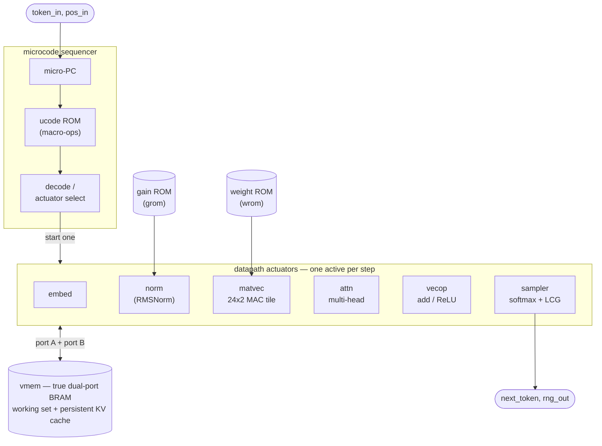

# gateGPT

<video src="https://github.com/user-attachments/assets/1f762090-1945-490e-9a63-43c8818fd41f" controls width="100%"></video>

**gateGPT**는 [Andrej Karpathy의 microGPT](https://karpathy.github.io/2026/02/12/microgpt/)
— 작은 문자 단위 GPT — 를 **Xilinx Virtex-5** FPGA(XC5VLX110T, XUPV5 /
ML509 보드, ISE 14.7, Verilog-2001)에서 전적으로 동작시키는 하드웨어(RTL) 구현이며,
여기서는 이름을 생성하도록 학습되었습니다. 이 모델(하나의 트랜스포머
블록: RMSNorm → 멀티헤드 인과적 어텐션 → MLP, Q5.11 고정소수점)은
**마이크로코드-ROM 시퀀서**로 실행되어 공유된 듀얼 포트 스크래치패드 위에서 모듈형 데이터패스 액추에이터를 구동합니다.
**영속적 KV 캐시를 사용하는 증분 디코딩**은 매 스텝마다 새 토큰의 K/V만 계산하고
캐시된 컨텍스트에 대해 어텐션을 수행하며, 전체 윈도우를 다시 계산하지 않습니다. 이 모델은 보드의
문자 LCD에 **80 MHz에서 초당 약 50,000 토큰**의 속도로 이름을 생성하며,
로터리 엔코더로 생성 속도와 샘플링 온도를 설정합니다.

이것은 독립적인 설계입니다 — RTL, 고정소수점 사양, 마이크로코드 ISA, 그리고 학습된
가중치 모두 우리가 직접 만든 것입니다. 처리량은 최초 동작 버전 대비 **28×** 향상되었으며(약 2.4k에서
**약 50–69k 토큰/초**로, 컨텍스트 길이에 따라 다름), 전부 Python 레퍼런스와 비트 단위로 정확하게 일치하고
보드에서 이름을 생성하는 것이 확인되었습니다(place-and-route 후 80 MHz에서 타이밍 클로징 완료).

---

## 아키텍처

추론 코어는 **모듈형 데이터패스 액추에이터를 구동하는 마이크로코드-ROM 시퀀서**입니다 —
손으로 작성한 단일 상태 머신이 아닙니다. 작은 프로그램 ROM(`generated/ucode.hex`,
`tools/ucode_asm.py`로 생성)이 트랜스포머 스케줄을 매크로 연산으로 인코딩하며, 마이크로-PC가 매
스텝마다 하나씩 페치하여 해당하는 액추에이터를 시작하고 `done`을 기다립니다. 액추에이터들은 진정한 듀얼 포트
활성값 스크래치패드(`vmem`, 하나의 Block RAM)를 공유하며, 이 스크래치패드는 영속적 KV 캐시도 담고 있습니다.



데이터패스 액추에이터(`core/`):

| 모듈 | 역할 |
|---|---|
| `matvec` | 병렬 곱셈-누산 타일 — 선형 프로젝션 (24 레인 × 2 컬럼/사이클) |
| `norm` | RMSNorm (`udiv` + `isqrt` 프리미티브), 듀얼 포트 vmem에서 2 원소/사이클 |
| `attn` | 헤드별 병렬 나눗셈기를 갖춘 단일 위치 멀티헤드 인과적 어텐션 |
| `exp_unit` | 테이블 + 선형 보간을 통한 고정소수점 `exp` |
| `sampler` | 온도 softmax + LCG 범주형 샘플링, 또는 그리디 argmax |
| `embed`, `vecop` | 임베딩 조회, 잔차 덧셈 / ReLU |
| `wrom`, `grom`, `vmem2` | 와이드 가중치 ROM, RMSNorm 게인, 진정한 듀얼 포트 활성값 스크래치패드 |

**모델:** 1개 트랜스포머 블록, `n_embed=24`, 4 헤드 × 헤드 차원 6, MLP 히든 96, 컨텍스트 16,
어휘 27개(`.` + `a`–`z`). 모든 연산은 부호 있는 **Q5.11** 고정소수점(FRAC=11)입니다.
Python 정수 레퍼런스(`tools/fixedpoint.py`)가 RTL이 일치시키는 비트 단위 정확한 사양입니다.

| 파라미터 | 값 |
|---|---|
| 블록 / 헤드 / 헤드 차원 | 1 / 4 / 6 |
| 임베딩 / MLP 히든 | 24 / 96 |
| 컨텍스트(블록 크기) / 어휘 | 16 / 27 |
| 수 형식 | Q5.11 부호 있는 16비트 |
| RNG / 나눗셈 | 32비트 LCG / 0 방향 절삭 |
| RMSNorm | 정수 `isqrt` + 역수 |
| `exp` | 17개 항목 테이블 + 선형 보간 |

---

## 결과 — 최적화 여정

아래의 모든 단계는 Python 레퍼런스와 **비트 단위로 정확하게 일치**하며(그리디 `alaya`, 시드 2·T=0.7에서 샘플링된 `rosphod`)
iSim 오라클에서 검증되었습니다. 처리량은 보드 클럭에서의 토큰당 값입니다.

| # | 단계 | 핵심 변경 | 사이클/토큰 | 토큰/초 @ 80 MHz | LUT | DSP | 상태 |
|---|---|---|---:|---:|---:|---:|---|
| 0 | 최초 코어 | 마이크로코드 코어, 전체 16-토큰 컨텍스트 재계산 | 32,872 | 2,433 | 8.6k | 15 | 33 MHz 보드 |
| 1 | 타이밍 재작업 | vmem→BRAM(등록된 읽기), 사전 읽기, 파이프라이닝 | 32,872 | 2,433 | ~9k | 15 | **80 MHz** 보드 |
| 2 | KV 캐시 | 증분 디코드, 절대 위치, 영속적 K/V | 10,192 | 7,849 | ~9k | 15 | 80 MHz |
| 3 | 병렬 MAC | 24-레인 시스톨릭 matvec 타일 | 2,757 | 29,016 | 14k | 35 | 80 MHz |
| 4 | 병렬 attn 나눗셈기 | 헤드별 동시 softmax 나눗셈 | 1,781 | 44,919 | 14k | 35 | **80.2 MHz** 보드 |
| 5 | radix-4 `udiv` | 나눗셈기가 사이클당 몫 2비트 처리 | 1,541 | 51,914 | – | – | 80 MHz |
| 6 | 좁은 `isqrt` + matvec 라이트백 오버랩 | 32비트 isqrt; 라이트백이 다음 타일 뒤에 숨음 | 1,428 | 56,022 | 17k | 35 | **80 MHz** 보드 |
| 7 | 듀얼 포트 vmem + RMSNorm 2×/사이클 | 진정한 듀얼 포트 BRAM 스크래치패드 | 1,356 | 58,997 | – | – | (중간 단계) |
| 8 | matvec 2 컬럼/사이클 + 2 행/사이클 라이트백 | 2배 폭 가중치 ROM, 듀얼 포트 읽기/쓰기 | 1,145 | 69,869 | 16.7k | 62 | 파이프라이닝 필요 |
| 9 | **오퍼랜드 파이프라인(최종)** | 곱셈 전 추가 레지스터 스테이지로 타이밍 클로징 | 1,156 | **69,204** | 15.5k | 62 | **80 MHz** 보드 ✅ |

**처리량, 최종 설계 @ 80 MHz**(비트 단위 정확, post-PAR 12.461 ns에서 클로징, 타이밍 에러 0):

| 지표 | 사이클/토큰 | 토큰/초 |
|---|---:|---:|
| 첫 토큰(최선의 경우) | 1,156 | ~69,200 |
| 전체 이름 평균 | 1,321 | ~60,600 |
| 최장 컨텍스트 토큰 | 1,488 | ~53,800 |

### FPGA 리소스 사용량

전체 보드(추론 코어 + LCD 드라이버 + 로터리 제어 + 토큰/초 미터 + DCM),
**XC5VLX110T-1 FF1136**에서 80 MHz post-PAR(최소 주기 12.458 ns, 타이밍 에러 0):

| 리소스 | 사용 | 가용 | 사용률 |
|---|---:|---:|---:|
| Slice LUT | 16,548 | 69,120 | 23% |
| &nbsp;&nbsp;— 로직으로 | 16,427 | 69,120 | 23% |
| &nbsp;&nbsp;— 분산 RAM으로 | 56 | 17,920 | <1% |
| Slice 레지스터(FF) | 5,530 | 69,120 | 8% |
| 점유된 Slice | 5,362 | 17,280 | 31% |
| **DSP48E** | **62** | **64** | **96%** |
| Block RAM (RAMB36) | 2 | 148 | 1% |
| BUFG | 2 | 32 | 6% |
| DCM_ADV | 1 | 12 | 8% |
| Bonded IOB | 29 | 640 | 5% |

**DSP가 제약 리소스입니다** — 24-레인 × 2-컬럼 matvec 타일이 62개 중 48개를 사용합니다. 그 외의
모든 것은 여유롭습니다(≤31%). 활성값 스크래치패드 + KV 캐시는 단일 듀얼 포트 Block RAM에 들어가며,
가중치/임베딩/마이크로코드 ROM은 LUT에 구워진 상수입니다(아래 브링업 노트 참조).

### 논리 게이트 추정

FPGA 리소스가 ASIC 게이트로 1:1 매핑되지는 않지만, 각 프리미티브를 **2입력 NAND
등가**(괄호 안은 계수)로 환산하면 전체 설계의 복잡도를 가늠할 수 있습니다:

| 요소 | 개수 | × 게이트/요소 | 게이트 등가 |
|---|---:|---:|---:|
| 로직 LUT6 | 16,427 | × 12 | ~197,000 |
| 플립플롭 | 5,530 | × 6 | ~33,000 |
| DSP48E (16×16 MAC로) | 62 | × 3,500 | ~217,000 |
| **총 로직** | | | **≈ 450,000 (~0.45 M) 게이트** |
| Block RAM (SRAM) | 2 × 36 Kb | (메모리) | 온칩 ~74 Kbit |

즉, 실제 설계는 **약 45만 개의 NAND2 등가 게이트** 규모입니다 — LUT 패브릭과
DSP 곱셈기가 각각 약 절반씩 기여합니다 — 여기에 온칩 SRAM ~74 Kbit(활성값
스크래치패드 + KV 캐시)가 더해집니다. 이는 *대략적인* 수치입니다: LUT 및 DSP-대-게이트 환산은 약
±2× 정도 편차가 있으며, FPGA 로직은 표준 셀 개수로 깔끔하게 변환되지 않습니다.

---

## 핵심 엔지니어링 교훈

- **KV 캐시가 단일 최대 성과입니다**(3.2×): 매 토큰마다 전체 컨텍스트를 재계산하는 것이
  순진한 디코더에서 지배적인 비용입니다. 절대 위치 학습으로 전환한 덕분에 이것이 가능해졌습니다.
- **합성 후 Fmax는 혼잡 상황에서 거짓말을 합니다.** 2-컬럼/사이클 matvec은 합성 후 88 MHz로
  보고되었지만 post-PAR에서 35 MHz로 붕괴했습니다 — 잘못 작성된 듀얼 포트 템플릿 때문에
  XST가 1024×16 스크래치패드를 Block RAM 대신 **16,384개의 플립플롭**으로 추론했기 때문입니다
  (HDL 리포트에서 `N flip-flops were inferred for signal <mem>`를 찾아보세요). 수정: 진정한 듀얼 포트 BRAM
  템플릿에서 **포트당 하나의 `always` 블록**을 사용합니다. LUT가 46.7k → 16.7k로 감소했습니다.
- **긴 BRAM→DSP 넷은 레지스터로 끊으세요.** 80 MHz까지의 마지막 0.14 ns는
  활성값/가중치 오퍼랜드를 한 스테이지 더 파이프라이닝하여 팬아웃이 높은 BRAM 출력 넷이
  곱셈의 크리티컬 패스에서 벗어나게 함으로써 클로징되었습니다.
- **정확한 정수 연산은 공짜로 병렬화됩니다.** radix-4 나눗셈과 분할 MAC 레인은
  floor-divide / 포화 결과를 보존하므로 골든이 절대 바뀌지 않습니다.

### 하드웨어 브링업: 시뮬레이션은 통과하지만 보드를 멈추게 하는 두 개의 XST 14.7 버그

비트 단위 정확한 iSim 골든은 매 단계마다 통과했지만, 첫 보드 실행은 **멈췄습니다**(배너 정지,
`gen_busy` 고착, 0 토큰/초) — 반면 로터리/LED는 여전히 동작했습니다. 두 개의 XST 14.7 합성-대-시뮬레이션
불일치가 원인이었으며, 둘 다 RTL 시뮬레이션에서는 나타나지 않습니다:

- **`$readmemh` ROM이 0으로 묶입니다.** XST는 작은 `$readmemh` 분산 ROM
  배열을 조용히 0으로 만듭니다(`.syr`에서 `Signal <name> is used but never assigned. Tied to default value`를 찾아보세요).
  이것이 **마이크로코드** ROM을 0으로 만들었고 → 시퀀서가 전부 NOP를 실행하여 결코 `HALT`에 도달하지 못하고 멈췄습니다.
  또한 가중치/exp/임베딩도 0으로 만들어 → 쓰레기 출력이 나왔습니다. `$readmemb`도 **도움이 되지 않습니다**(같은
  메커니즘). 수정: 코어가 읽는 모든 ROM을 **조합 `case` 함수**로 방출합니다(XST가 LUT에 신뢰성 있게
  구워 넣는 명시적 상수) — `core/ucode_rom.vh`, `wrom_data.vh`, `tok_emb.vh`,
  `pos_emb.vh`, `exp_data.vh`, `gains.vh`를 참조하세요. `.syr`의 "tied to default" 목록이 비어 있는지 확인하세요.
- **살아 있는 레지스터가 상수 폴딩으로 제거될 수 있습니다.** XST가 matvec의 타일 베이스 `obase`를
  상수 0으로 트리밍했고(`has a constant value of 0 ... will be trimmed`), 그 결과 모든 **멀티 타일** 행렬곱
  (fc1/lm)이 무한 루프에 빠졌습니다 — 코어가 마이크로코드 `pc=9`(fc1 matvec)에서 멈췄습니다. `pc`를 LED에
  띄우는 디버그 프로브로 위치를 특정했습니다. 수정: `obase`/`wbase`에 `(* keep = "true" *)`를 붙입니다. 또한
  `integer` 파라미터를 비트 선택하는 것(`LANES[6:0]`)을 피하세요 — 먼저 크기가 지정된 `localparam`에 할당하세요.

**요점:** post-PAR 타이밍 클로징 ≠ 동작하는 설계. XST 14.7에서는 결코 ROM 초기화에 `$readmemh`를 신뢰하지 말고
(`case` 함수를 사용), "constant value / tied to default" 경고를 버그로 취급하세요.
둘 다 수정하면 보드는 80 MHz에서 이름을 올바르게 생성합니다.

---

## 레이아웃

```
core/         독립 추론 코어(RTL) + 생성된 인클루드 (*.vh)
board/        XUPV5 top, HD44780 LCD 드라이버, 로터리 제어, 초당 토큰 미터, UCF
tools/        모델, 학습, 고정소수점 레퍼런스, 가중치/마이크로코드 익스포트
data/         공개 makemore 이름 코퍼스(학습 데이터)
generated/    고정소수점 가중치 ROM (*.hex) + 마이크로코드 프로그램 (ucode.hex)
sim/          iSim 테스트벤치(액추에이터별 + 엔드투엔드 골든)
```

## 빌드 & 실행

모델 아티팩트를 학습하고 익스포트합니다(Python 3 + numpy + torch):

```bash
python tools/train.py            # -> tools/weights.npz
python tools/export.py           # -> generated/*.hex, core/core_params.vh, gains.vh
python tools/ucode_asm.py        # -> generated/ucode.hex, core/coremap.vh
```

골든에 대해 코어를 시뮬레이션합니다(Xilinx iSim):

```bash
fuse -incremental -prj tb_core.prj -o sim/tb_core_sim work.tb_core
./sim/tb_core_sim -tclbatch sim/isim_run.tcl     # prints CYCLES_PER_TOKEN + CORE PASS
```

보드 비트스트림을 빌드합니다(ISE 14.7): `xst → ngdbuild → map → par → trce → bitgen`,
`xupv5_microgpt_top.prj` / `board/xupv5_microgpt.ucf`에 대해 파트 `xc5vlx110t-1-ff1136`로 실행.

## 보드

XUPV5에서 검증됨: 이름이 80 MHz에서 LCD에 생성되어 스크롤됩니다.

- 100 MHz 오실레이터 → DCM CLKFX ×4/5 → **80 MHz** 코어 클럭.
- 이름이 자동 생성됩니다. **로터리 엔코더**는 두 설정 중 하나를 조정하며, 엔코더를
  **눌러서** 선택합니다:
  - **RATE** — 자동 회전 속도, 약 1 Hz(읽기 좋은 속도)부터 연속(최대 처리량)까지.
  - **TEMP** — 샘플링 온도, `T = 0.5 … 1.2`를 0.1 단위로(기본값 0.7).
- TEMP 모드에서는 `led[5]`가 켜집니다. LCD 1행은 현재 이름을, 2행은 활성
  설정(`rate: NNNNN t/s` 측정값, 또는 `temp: X.Y`)을 표시합니다. `led[7]`은 1 Hz 하트비트입니다.
```
