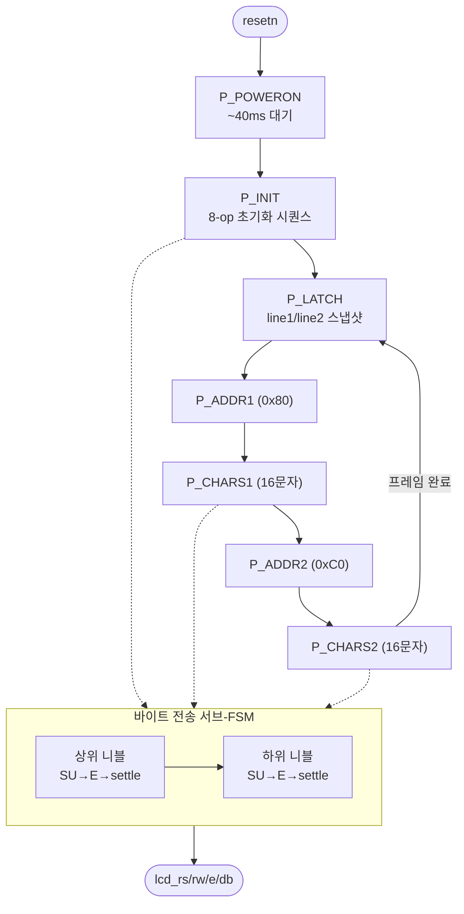

# `lcd_hd44780.v` 분석

## 개요

`lcd_hd44780.v`는 범용 **HD44780 문자 LCD 컨트롤러**로, 4비트 모드(쓰기 전용), 2행입니다.
전원 투입 초기화를 수행한 뒤, `line1`/`line2`(각 16 ASCII 바이트, 바이트 i = 열 i)로 두 행을
**연속적으로 다시 그립니다**. 각 프레임은 먼저 line1/line2를 래치하여 프레임 중간 변경이 화면을
찢지 않게 합니다. 호출자가 완성된 ASCII를 공급하므로(토큰→문자/숫자 포맷은 최상위에서) 이것은 단순 패널입니다.

모든 지연은 `CLK_HZ`(실시간)에서 파생되어 어떤 코어 클럭에서도 정확합니다. 시뮬레이션은 작은 `CLK_HZ`를
넘겨 지연을 축소할 수 있습니다.

## 블록 다이어그램

## 인터페이스

| 신호 | 역할 |
|---|---|
| `line1`, `line2` (128비트) | 두 행 ASCII |
| `lcd_rs`, `lcd_rw`, `lcd_e`, `lcd_db` | HD44780 4비트 인터페이스 |
| `ready` | 초기화 완료 |

## 핵심 설계 포인트

- **메인 페이즈 FSM**: POWERON → INIT → LATCH → ADDR1 → CHARS1 → ADDR2 → CHARS2 → (LATCH 반복).
- **바이트 전송 서브-FSM**: 각 니블마다 RS/데이터 셋업(tAS) → E high → settle. `is_nibble`=1이면 상위 니블만(8→4비트 전환용).
- **tear-free**: `P_LATCH`에서 `l1_buf`/`l2_buf`로 스냅샷.
- **실시간 지연**: `POWERON_CYC`, `LONG_CYC`, `SETTLE_CYC`, `E_CYC`, `SU_CYC` 모두 `CLK_HZ` 파생.

## 초기화 시퀀스 (8-op)

wake ×3 → 4비트 모드 → function set(4비트/2행) → display on → clear → entry mode(증가).

## RTL과의 관계
`xupv5_microgpt_top`이 인스턴스화, `line1`(배너/이름)·`line2`(rate/temp)를 공급. 순수 표시 장치.
