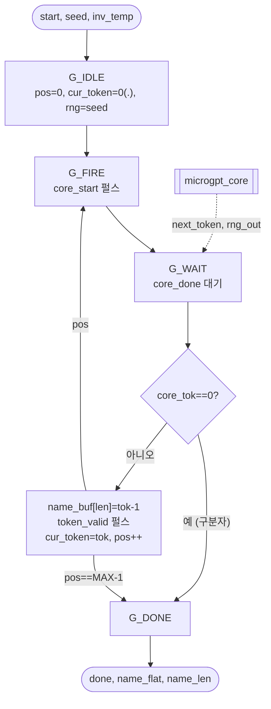

# `name_generator.v` 분석

## 개요

`name_generator.v`는 **자기회귀 이름 생성기**입니다. 독립적인 `microgpt_core`를 구동하며,
코어는 증분 디코딩(절대 위치에서 토큰당 한 번, 영속적 KV 캐시)을 수행합니다. 위치 카운터,
현재 토큰, RNG 상태를 유지하고, 이름을 패킹된 바이트 + 토큰별 스트로브로 방출합니다.
토큰은 0=`.`, 1..26=`a`..`z`; `name_buf`는 `(token-1)`을 저장해 0..25 → `a`..`z` 표시 매핑이 동작합니다.

## 블록 다이어그램

## 인터페이스

| 신호 | 역할 |
|---|---|
| `start`, `seed`, `inv_temp`, `sample_mode` | 생성 시작/시드/온도/모드 |
| `busy`, `done` | 상태 |
| `token_out`, `token_valid` | 토큰별 출력 + 스트로브 |
| `name_len`, `name_flat` | 이름 길이 + 패킹된 바이트 |

## 핵심 설계 포인트

- **증분 루프**: 각 반복에서 `cur_token`/`pos`/`rng`를 코어에 전달, 결과 토큰을 다음 입력으로 피드백.
- **절대 위치**: `pos`가 0부터 증가(KV 캐시가 가능한 이유).
- **표시 매핑**: `name_buf`에 `token-1` 저장 → 최상위에서 0..25 → 'a'..'z'.
- **종료 조건**: 구분자 토큰(0) 또는 `pos == MAX_LEN-1`.

## FSM

`G_IDLE → G_FIRE → G_WAIT → (반복 | G_DONE) → G_IDLE`

## RTL과의 관계
`microgpt_core`를 인스턴스화하는 래퍼. `xupv5_microgpt_top`이 이를 구동하고 LCD/미터에 연결.
