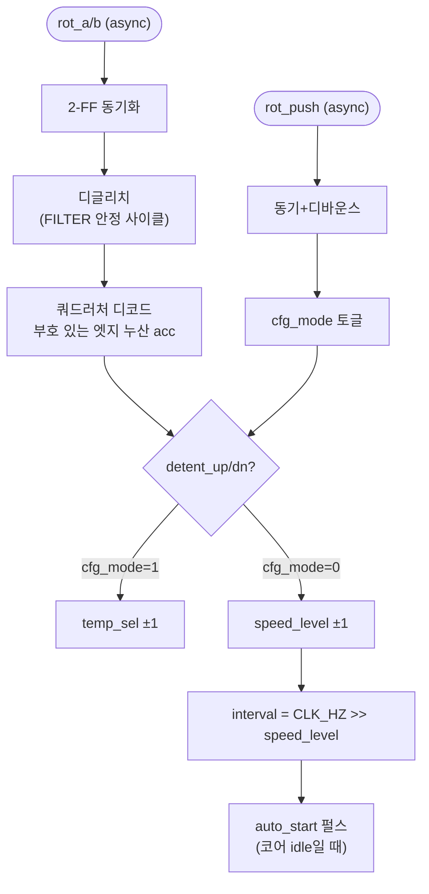

# `rotary_throttle.sv` 분석

## 개요

`rotary_throttle.sv`는 이름 생성기용 **로터리 엔코더 제어**입니다(Panasonic EVQWK4001, 15 디텐트).
엔코더를 돌리면 푸시 버튼으로 선택된 두 설정 중 하나를 조정합니다:
- `cfg_mode = 0` (RATE): 레벨 0..MAX_LEVEL이 자동 회전 간격을 설정(1 Hz에서 연속까지 지수적으로).
- `cfg_mode = 1` (TEMP): 레벨 0..NTEMP-1이 샘플링 온도를 선택.

디바운스된 **누르기**가 `cfg_mode`를 토글합니다. 최상위의 LED/LCD가 활성 모드를 표시합니다.

## 블록 다이어그램

## 인터페이스

| 신호 | 역할 |
|---|---|
| `rot_a`, `rot_b`, `rot_push` | 엔코더 위상/푸시(비동기) |
| `gen_busy` | 생성기 바쁨(발사 게이트) |
| `auto_start` | 생성 시작 1사이클 펄스 |
| `speed_level`, `temp_sel`, `cfg_mode` | RATE/TEMP 설정 + 활성 모드 |

## 핵심 설계 포인트

- **2-FF 동기화 + 디글리치**: 비동기 입력을 안정화(FILTER ~50 µs, 위상선; PUSH ~2 ms).
- **쿼드러처 디코드**: 상태 전이 `tr = {ab_d, ab}`로 up/dn 엣지 판정, `EDGES_PER_DETENT=4`마다 한 디텐트.
- **스타트업 홀드오프**: `STARTUP_HOLD`(~200 ms) 동안 무장 해제(전원 투입/DCM lock 안정화).
- **지수적 간격**: `interval = CLK_HZ >> speed_level`, 레벨 0 = 1 Hz.
- **기본값**: `temp_sel=2`(T=0.7), `speed_level=0`.

## RTL과의 관계
`xupv5_microgpt_top`이 인스턴스화. `auto_start`가 `gen_start`을 구동, `temp_sel`은 `temp_lut`로,
`cfg_mode`/`speed_level`은 LED/LCD 표시에 사용.
