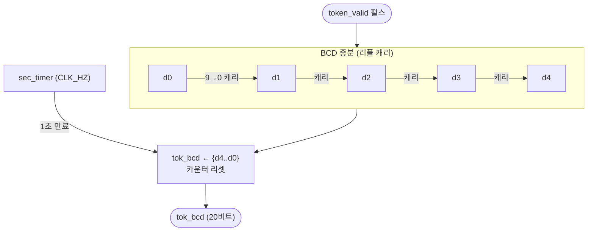

# `tok_meter.sv` 분석

## 개요

`tok_meter.sv`는 **실제 초당 토큰 미터**입니다. `token_valid` 스트로브를 1초 윈도우 동안 세고,
초당 한 번 그 개수를 5개 BCD 자릿수(0..99999)로 래치합니다. BCD로 직접 세면 이진→십진 나눗셈이
불필요합니다(XST는 2의 거듭제곱으로만 나눔).

## 블록 다이어그램

## 인터페이스

| 신호 | 역할 |
|---|---|
| `token_valid` | 생성 토큰당 1사이클 펄스 |
| `tok_bcd` (20비트) | `{d4,d3,d2,d1,d0}` 각 4비트, 초당 래치 |

## 핵심 설계 포인트

- **BCD 리플 캐리 증분**: `d0`이 9에서 0으로 넘어갈 때 상위 자릿수로 캐리 전파.
- **포화(`at_cap`)**: 99999에서 증분 중단.
- **초 윈도우**: `sec_timer >= CLK_HZ-1`에서 `tok_bcd` 발행 후 리셋.
- **나눗셈 회피**: 십진 표시를 위해 이진→십진 변환 없이 처음부터 BCD로 카운트.

## RTL과의 관계
`xupv5_microgpt_top`이 인스턴스화, `name_generator`의 `token_valid`를 입력받아 `tok_bcd`를
LCD 2행 "rate: NNNNN t/s"에 표시.
