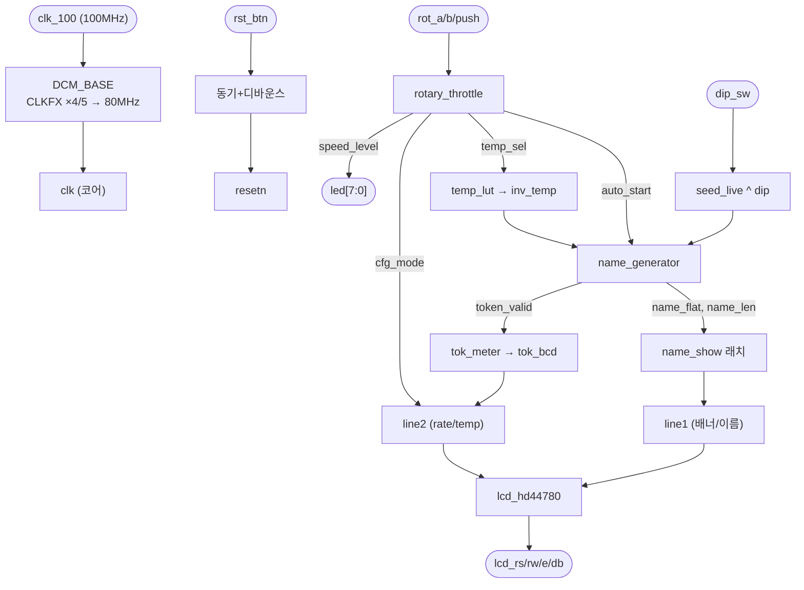

# `xupv5_microgpt_top.sv` 분석

## 개요

`xupv5_microgpt_top.sv`는 microGPT 이름 생성기를 위한 **XUPV5(Virtex-5 XC5VLX110T) 보드 최상위**입니다.

데모: 이름이 16×2 LCD에 자동으로 순환합니다. **로터리 엔코더**가 두 설정 중 하나를 조정하며,
**누르기**로 선택합니다: RATE(회전 속도, 1 Hz ~ 연속) 또는 TEMP(샘플링 온도, T=0.5..1.2).
TEMP 모드에서 `led[5]` 점등, LCD 2행은 활성 설정(`rate: NNNNN t/s` 또는 `temp: X.Y`) 표시.
DIP 스위치가 랜덤 시드를 교란합니다. 코어는 80 MHz(DCM CLKFX ×4/5), post-PAR 80.24 MHz, 타이밍 에러 0.

## 블록 다이어그램

## 주요 블록

| 블록 | 역할 |
|---|---|
| `DCM_BASE` | 100 MHz → 80 MHz 코어 클럭(CLKFX ×4/5), CLK0 피드백 |
| 리셋 디바운스 | `rst_btn`을 ~2 ms 안정화 후 동기 리셋; DCM lock까지 리셋 유지 |
| start 버튼 디바운스 | ~66 Hz 글리치 라인을 걸러냄(의도적으로 트리거로 미사용) |
| `seed_live` | 자유 실행 카운터 + DIP 스위치 XOR → 시드 |
| `rotary_throttle` | 회전=rate/temp 조정, 누르기=모드 전환 |
| `temp_lut` | temp_sel 0..7 → T=0.5..1.2의 inv_temp(Q11) |
| `name_generator` | 코어 구동, 이름 생성 |
| `tok_meter` | 초당 토큰 측정(BCD) |
| `lcd_hd44780` | LCD 렌더링(2행) |

## 핵심 설계 포인트

- **start_btn 미사용**: 이 보드에서 해당 라인이 ~66 Hz로 자유 실행하여 2 ms 디바운스를 통과,
  ~330 t/s 바닥값을 만들었음. gen_start=0 브링업 테스트로 원인 확인 후 트리거에서 제외.
- **LCD 문자열 리터럴**: col0을 LSB 바이트에 두는 역순 리터럴(예: `"   omed TPGorcim"`).
- **LED**: `led[7]`=1 Hz 하트비트(클럭 검증), `led[6]`=gen_busy, `led[5]`=cfg_mode, `led[4:0]`=speed_level.
- **ChipScope VIO**(`CHIPSCOPE_VIO`): 선택적 PC 측 제어(USB JTAG).

## RTL과의 관계
보드 최상위로, 코어(`name_generator`→`microgpt_core`)와 주변장치(로터리/LCD/미터/DCM)를 통합.
`board/xupv5_microgpt.ucf`가 핀 매핑을 제공.
