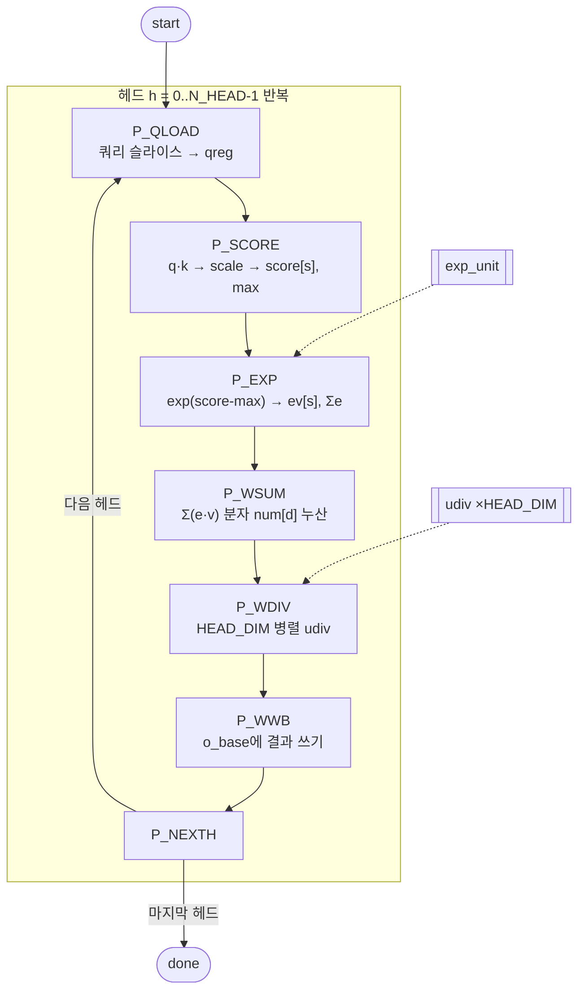

# `attn.v` 분석

## 개요

`attn.v`는 **단일 위치 멀티헤드 어텐션** 엔진으로, 등록된 vmem 읽기(1사이클 지연, read-ahead)를 사용합니다.
헤드마다: 쿼리 슬라이스 로드 → `score = scale·(q·k)` → max-차감 + exp + sum으로 softmax →
`output = Σ(e·v)/Σe`(절삭 나눗셈).

한 헤드의 HEAD_DIM개 출력 성분은 같은 softmax 합으로 나누므로, 분자들을 먼저 누산한 뒤
**HEAD_DIM개의 병렬 나눗셈기**로 동시에 나눕니다(성분당이 아니라 헤드당 나눗셈 지연 1회).
`QModel.attn_debug`와 비트 단위로 일치합니다.

## 블록 다이어그램

## 인터페이스

| 신호 | 역할 |
|---|---|
| `attn_scale`, `ctx_len` | 스케일(Q11), 유효 컨텍스트 길이(pos+1) |
| `q_base`/`k_base`/`v_base`/`o_base` | vmem 내 q/K/V/출력 베이스 |
| `v_raddr`, `v_rdata`, `v_we`, `v_waddr`, `v_wdata` | vmem 읽기/쓰기 |

## 핵심 설계 포인트

- **read-ahead**: 주소를 한 사이클 먼저 제시하고, 지연 인덱스(`s_d`, `d_d`)로 도착한 데이터가
  어느 원소인지 태그.
- **점수 2단 파이프라인**: 완료된 닷 프로덕트를 `dot_raw`에 등록한 뒤, 다음 사이클에
  `scale_score`(2차 곱셈 + 포화)와 max 비교 실행.
- **병렬 나눗셈기**: `generate`로 HEAD_DIM개 `udiv` 인스턴스, 공유 `d_start` 펄스로 동시 발사.
  분자 부호를 처리해 절삭 나눗셈 결과를 재현.
- **`exp_unit`**: 입력을 내부 등록(지연 1)하는 파이프라인 exp.

## FSM 페이즈

`P_IDLE → P_QLOAD → P_SCORE → P_EXP → P_WSUM → P_WDIV → P_WWB → P_NEXTH`

## RTL과의 관계
`microgpt_core`가 `OP_ATTN`에서 호출(ctx_len = pos+1). `exp_unit`, `udiv` 프리미티브에 의존.
`tb_attn.v`가 `.saa` 컨텍스트로 Python 레퍼런스와 검증. 병렬 나눗셈기가 스테이지 4의
44,919 tok/s 성과의 핵심.
