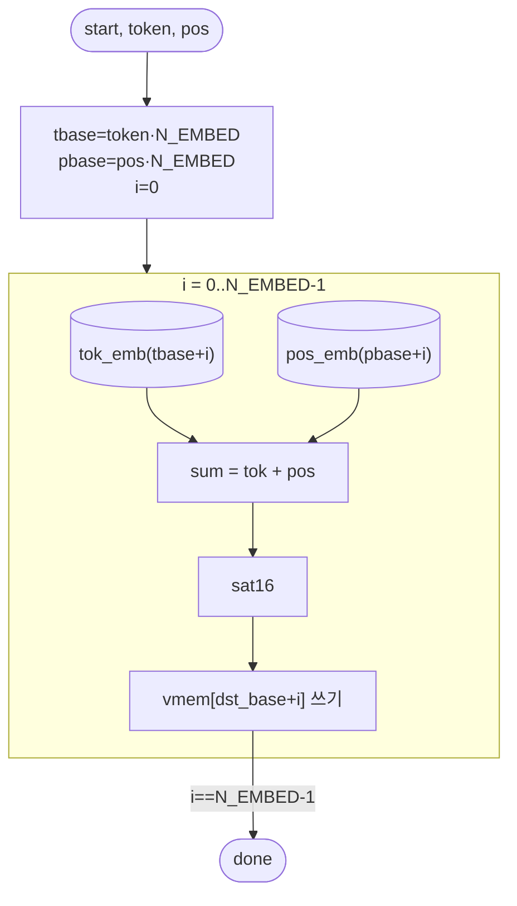

# `embed.v` 분석

## 개요

`embed.v`는 **임베딩 조회**입니다:
`emb[i] = sat16(tok_embed[token][i] + pos_embed[pos][i])`, i = 0..N_EMBED-1을
`vmem[dst_base+i]`에 씁니다. 토큰/위치 임베딩 ROM은 Q5.11.

## 블록 다이어그램

## 인터페이스

| 신호 | 역할 |
|---|---|
| `token`, `pos`, `dst_base` | 토큰 id, 위치, 목적지 |
| `v_we`, `v_waddr`, `v_wdata` | vmem 쓰기 |

## 핵심 설계 포인트

- **조합 case 임베딩 ROM**: `tok_emb`(27×24), `pos_emb`(16×24)는 `$readmemh`가 아닌
  `tok_emb.vh`/`pos_emb.vh`의 case 함수(XST가 작은 `$readmemh` ROM을 0으로 만들기 때문).
- **행 우선 인덱싱**: `tbase = token·N_EMBED`, `pbase = pos·N_EMBED`.
- **포화 덧셈**: 17비트 합을 16비트로 sat16.

## RTL과의 관계
`microgpt_core`가 `OP_EMBED`에서 매 토큰 처음 호출(TMP에 씀). ROM들은 `export.py`가 생성.
