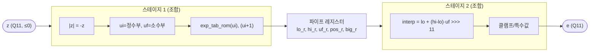

# `exp_unit.v` 분석

## 개요

`exp_unit.v`는 z ≤ 0에 대한 **고정소수점 exp**입니다:
`e = round(exp(z/2048) · 2048)` ∈ [0, 2048], **17개 항목 테이블**(exp(-k)) + **선형 보간**.
`tools/fixedpoint.exp_neg_q11`과 비트 단위로 일치. (z ≥ 0이면 2048 = exp(0) 반환.)

**파이프라인(지연 1)**: 테이블 조회 + 디코드를 등록하고, 보간 곱셈은 다음 사이클에 실행 →
짧은 조합 경로(이 체인이 파이프라인 이후 Fmax 제한 요소였음). 호출자는 z를 넣고 한 사이클 뒤 e를 읽습니다.

## 블록 다이어그램

## 인터페이스

| 신호 | 역할 |
|---|---|
| `z` | 입력 지수(Q11, 부호 있음) |
| `e` | `exp(z)` (Q11, 1사이클 지연) |

## 핵심 설계 포인트

- **조합 case 테이블**: `exp_tab_rom`은 `$readmemh`가 아닌 `exp_data.vh`의 case 함수
  (XST가 작은 `$readmemh` ROM을 0으로 만들기 때문).
- **파이프 컷**: ROM 조회와 보간 곱셈 사이에 레지스터를 삽입.
- **특수값**: `pos_r`(z≥0)이면 2048, `big_r`(ui≥16)이면 0, 음수 보간은 0으로 클램프.

## RTL과의 관계
`attn`(softmax)과 `sampler`(온도 softmax)가 인스턴스화. `exp_data.vh`는 `export.py`가 생성.
`tb_exp.v`가 z 스윕으로 Python 레퍼런스와 검증.
