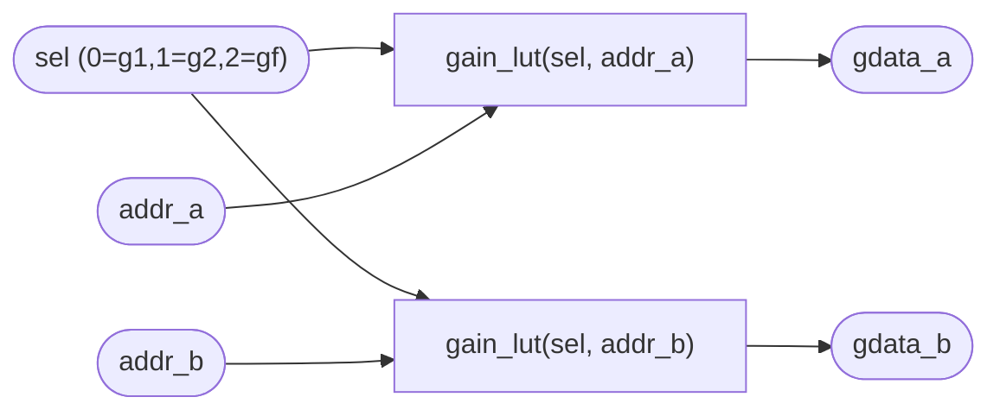

# `grom.sv` 분석

## 개요

`grom.sv`는 **RMSNorm 게인 ROM**(Q5.11)입니다. `sel`로 세 게인 중 하나를 선택(0=g1, 1=g2, 2=gf).
`core/gains.vh`의 조합 case로 방출됩니다 — XST가 이렇게 작은 배열은 `$readmemh` ROM을 신뢰성 있게
추론/초기화하지 못하고 0으로 묶어 하드웨어에서 게인이 0이 되어 쓰레기를 냈기 때문. 상수는 올바르게 합성됩니다.
**듀얼 읽기**(`addr_a`/`addr_b`)로 2원소/사이클 스케일 패스가 두 게인을 동시에 가져옵니다.

## 블록 다이어그램

## 인터페이스

| 신호 | 역할 |
|---|---|
| `sel` (2비트) | 게인 세트 선택 |
| `addr_a`, `addr_b` (6비트) | 두 원소 인덱스 |
| `gdata_a`, `gdata_b` | 두 게인 값(Q11 부호 있음) |

## 핵심 설계 포인트

- **조합 case (`gain_lut`)**: `gains.vh`, 명시적 상수로 합성 신뢰성 확보.
- **듀얼 포트**: `norm`의 2원소/사이클 스케일 패스와 정렬.

## RTL과의 관계
`microgpt_core`가 `norm`과 함께 인스턴스화, `gsel`을 전달. `gains.vh`는 `export.py`가 생성.
`tb_norm.sv`가 sel=0(g1)로 인스턴스화.
