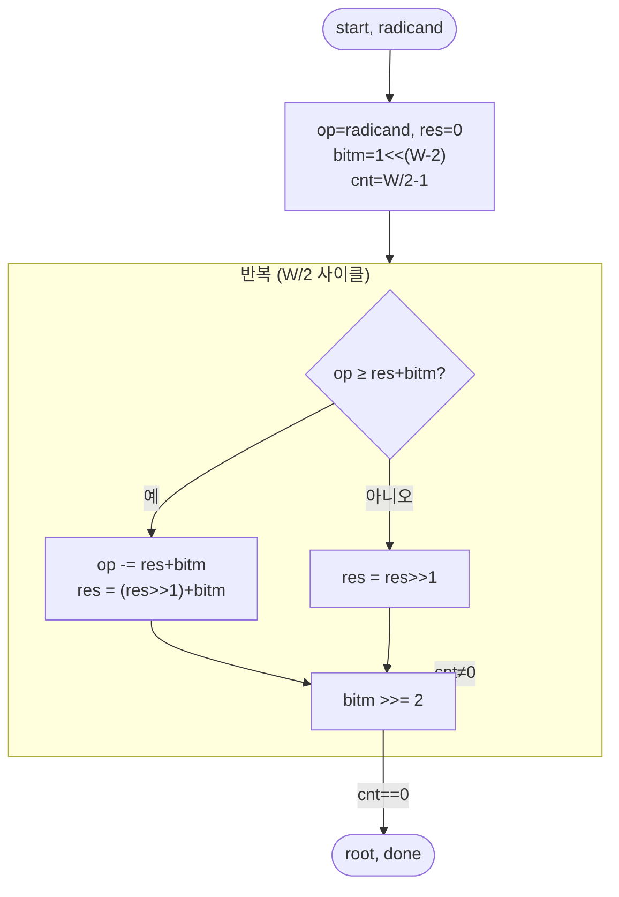

# `isqrt.v` 분석

## 개요

`isqrt.v`는 **부호 없는 정수 제곱근**입니다: `root = floor(sqrt(radicand))`,
W비트 radicand → W/2비트 root. 고전적 비트-페어(비복원, non-restoring) 알고리즘, W/2 사이클.
Python `math.isqrt`와 일치. RMSNorm이 사용하며 합성 가능.

## 블록 다이어그램

## 인터페이스

| 신호 | 역할 |
|---|---|
| `radicand` (W비트) | 입력 |
| `root` (W/2비트) | floor(sqrt) |
| `busy`, `done` | 상태 |

## 핵심 설계 포인트

- **비트-페어 알고리즘**: `bitm`(4의 거듭제곱)을 상위 짝수 비트부터 내려가며, 각 사이클에서
  `res + bitm`과 비교해 결과 비트를 결정.
- **마지막 사이클**: `cnt == 0`에서 최종 floor(sqrt)를 `root`에 노출.

## RTL과의 관계
`norm`이 `mean_sq`의 제곱근에 사용(RMSNorm의 역제곱근 계산). 스테이지 6에서 32비트로 좁혀
자원을 절감. `tb_mathops.v`가 Python `math.isqrt` 값과 검증.
