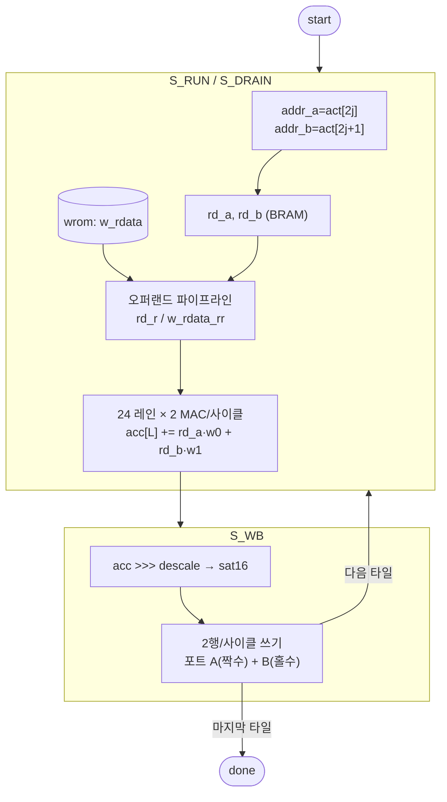

# `matvec.sv` 분석

## 개요

`matvec.sv`는 **병렬 행렬-벡터 엔진**입니다:
`out[o] = sat16((Σᵢ act[act_base+i] · W[sel][o,i]) >>> descale)`, o = 0..out_dim-1을
`vmem[dst_base+o]`에 씁니다.

출력 행은 `LANES`(=24)개씩 한 타일로 처리합니다. **진정한 듀얼 포트 vmem**을 사용해 매 계산 사이클마다
활성값 **두 개**(`act[2j]`, `act[2j+1]`)를 읽고, 와이드 가중치 ROM이 두 열의 LANES개 가중치를 반환하므로
각 레인이 사이클당 **2 MAC** → 타일이 `in_dim/2` 사이클에 계산됩니다. 라이트백은 두 쓰기 포트로
사이클당 **2행**을 배출 → `LANES/2` 사이클. `tiles = ceil(out_dim/LANES)`.

## 블록 다이어그램

## 인터페이스

| 신호 | 역할 |
|---|---|
| `wsel`, `in_dim`, `out_dim` | 가중치 선택 / 차원 |
| `act_base`, `dst_base`, `descale` | 소스/목적지 주소, 시프트량 |
| `addr_a/b`, `rd_a/b`, `we_a/b`, `wd_a/b` | 듀얼 포트 vmem 연결 |
| `w_addr`, `w_rdata` | 타일 가중치 ROM (`tile*(in_dim/2)+j`, 768비트) |

## 핵심 설계 포인트

- **`LANES_W` (sized localparam)**: `integer` 파라미터를 비트 선택하면(`LANES[6:0]`) XST 14.7이
  `obase`를 0으로 만들어 멀티 타일 행렬곱이 보드에서 멈춤. 크기 지정 localparam으로 회피.
- **`(* keep = "true" *)` on `obase`/`wbase`**: 상수 폴딩으로 트리밍되는 것을 방지.
- **2단 오퍼랜드 파이프라인**: 활성값과 가중치를 곱셈 전에 한 스테이지 더 등록 →
  긴 BRAM 출력→DSP 넷을 크리티컬 패스에서 제거(80 MHz 클로징의 마지막 0.14 ns).

## FSM

| 상태 | 동작 |
|---|---|
| `S_RUN` | 열 쌍을 피드하며 MAC 누산 |
| `S_DRAIN` | 2단 파이프라인의 마지막 열 쌍 플러시 |
| `S_WB` | 2행/사이클 라이트백, 다음 타일 or 종료 |

## RTL과의 관계
`microgpt_core`가 wq/wk/wv/wo/fc1/fc2/lm 프로젝션마다 호출. `wrom`이 타일 가중치를 공급.
`tb_matvec.sv`가 wq 결과를 Python 레퍼런스와 검증. DSP 사용의 대부분(48/62)을 차지하는 바인딩 리소스.
