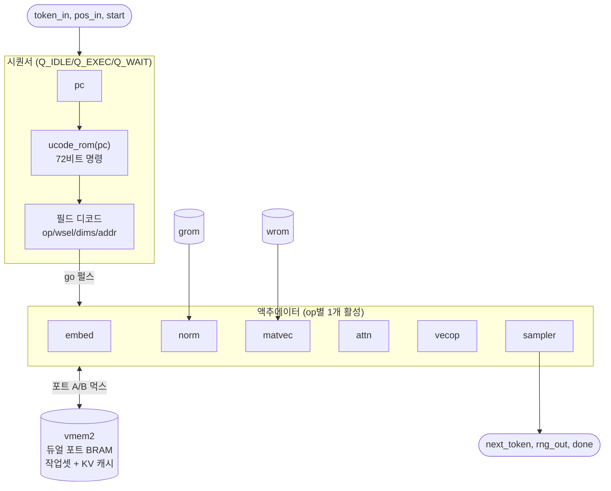

# `microgpt_core.v` 분석

## 개요

`microgpt_core.v`는 독립적인 microGPT 추론 코어 — **모듈형 데이터패스 액추에이터를 구동하는
마이크로코드-ROM 시퀀서**입니다. 프로그램 ROM(`generated/ucode.hex`)이 스케줄을 매크로 연산으로
담고, 시퀀서가 매 스텝마다 하나를 페치해 해당 액추에이터를 시작하고 `done`을 기다립니다.

**영속적 KV 캐시를 사용하는 증분 디코딩**: 각 호출은 위치 `pos_in`의 새 토큰 `token_in` 하나를
처리하여, 그 K/V를 캐시 슬롯 `KC[pos]`/`VC[pos]`(`use_pos`)에 쓰고, 위치 0..pos_in에 어텐션합니다.
KC/VC 캐시는 `vmem`에 있고 호출들에 걸쳐 유지됩니다. `tools/fixedpoint.QModel.logits_last`와 비트 단위로 일치합니다.

## 블록 다이어그램

## 인터페이스

| 신호 | 방향 | 역할 |
|---|---|---|
| `start`, `token_in`, `pos_in` | in | 토큰 처리 시작 |
| `sample_mode`, `inv_temp`, `rng_in` | in | 샘플링 모드/온도/RNG |
| `busy`, `done` | out | 상태 |
| `next_token`, `rng_out` | out | 결과 토큰 + 진행된 LCG |

## 주요 내부 구조

- **프로그램 ROM**: `ucode_rom(pc)`은 `$readmemh`가 아닌 **조합 함수**(`ucode_rom.vh`) — XST 14.7이
  작은 `$readmemh` ROM을 0으로 묶으면 프로그램이 전부 NOP가 되어 코어가 멈추기 때문.
- **명령 디코드**: 72비트 워드에서 `op`, `wsel`, `in_dim`, `out_dim`, `descale`, `gsel`,
  `a_base`/`b_base`/`d_base`, `use_pos`를 비트 슬라이스.
- **`mv_dst`**: `use_pos`면 `d_base + pos_r*N_EMBED`(KV 캐시 슬롯).
- **공유 `vmem2`(듀얼 포트)**: 포트 A는 주 읽기(+norm/matvec 쓰기), 포트 B는 주 쓰기(+norm/matvec 읽기).
- **액추에이터 인스턴스**: `embed`, `norm`(+`grom`), `matvec`(+`wrom`), `attn`, `vecop`, `sampler`.
- **포트 먹스**: 현재 `op`에 따라 활성 액추에이터의 주소/we/wdata를 vmem 포트에 연결.

## 시퀀서 FSM

| 상태 | 동작 |
|---|---|
| `Q_IDLE` | `start`에서 pc=0, 입력 래치 후 `Q_EXEC`로 |
| `Q_EXEC` | op에 맞는 go 펄스 발생. `OP_HALT`면 done. 아니면 `Q_WAIT` |
| `Q_WAIT` | `act_done`에서 SAMPLE 결과 래치, pc++, `Q_EXEC` |

## RTL과의 관계
이 모듈이 코어의 최상위이며, `name_generator`가 이를 감싸 자기회귀 생성 루프를 구동합니다.
`tb_core.v`가 전체 경로를 Python 골든과 비교합니다.
