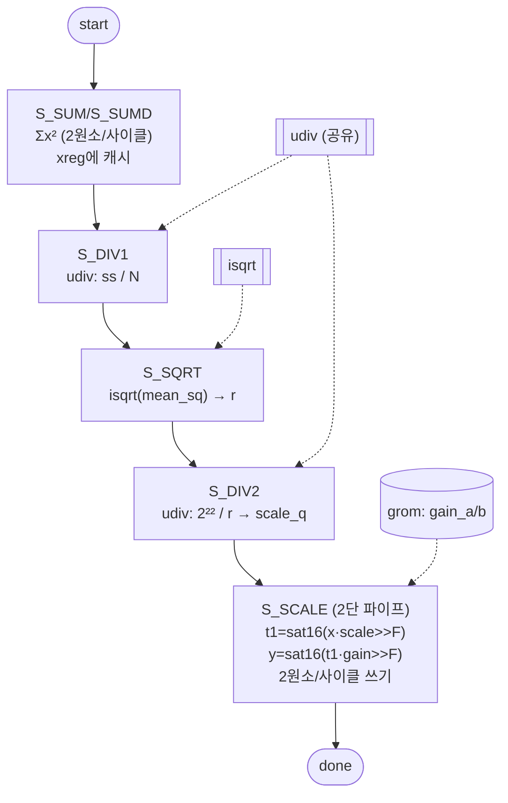

# `norm.v` 분석

## 개요

`norm.v`는 **RMSNorm 엔진**입니다:
`y[i] = sat16(sat16(x[i]·scale >> FRAC) · gain[i] >> FRAC)`,
`scale = min(2^(2·FRAC) / isqrt(sum(x²)/N), 32767)`.
Python 레퍼런스(`tools/fixedpoint.rmsnorm`)와 비트 단위로 일치합니다.

**진정한 듀얼 포트 vmem**을 사용: 제곱합 패스는 사이클당 2원소 읽기(포트 A+B), 스케일 패스는
사이클당 2원소 쓰기 → 두 N-길이 루프가 각각 N/2 사이클(N은 짝수). 읽기 주소는 조합적으로 구동
(vmem 내부 등록 읽기 → 1사이클 지연, read-ahead).

## 블록 다이어그램

## 인터페이스

| 신호 | 역할 |
|---|---|
| `src_base`, `dst_base`, `gain_sel` | 소스/목적지, 게인 선택(g1/g2/gf) |
| `addr_a/b`, `rd_a/b`, `we_a/b`, `wd_a/b` | 듀얼 포트 vmem |
| `g_addr_a/b`, `g_rdata_a/b` | 게인 ROM 듀얼 읽기 |

## 핵심 설계 포인트

- **공유 `udiv`/`isqrt`**: `ss/N`과 `2²²/r`에 같은 나눗셈기를 재사용, mean_sq의 제곱근에 `isqrt`.
- **32비트 isqrt**: mean_sq ≤ 2³⁰이므로 좁은 isqrt로 충분(스테이지 6 최적화).
- **스케일 패스 2단 파이프라인**: `t1a_r`/`ga_r` 등 레지스터로 곱셈 체인을 분할.
- **2원소/사이클**: 듀얼 포트로 제곱합 읽기와 스케일 쓰기를 각각 병렬화.

## FSM

`S_IDLE → S_SUM → S_SUMD → S_DIV1 → S_SQRT → S_DIV2 → S_SCALE → S_IDLE`

## RTL과의 관계
`microgpt_core`가 `OP_NORM`에서 3회 호출(norm1/norm2/norm_f, gsel로 게인 선택). `grom`이 게인,
`udiv`/`isqrt`가 산술 프리미티브 공급. `tb_norm.v`가 Python 레퍼런스와 검증.
