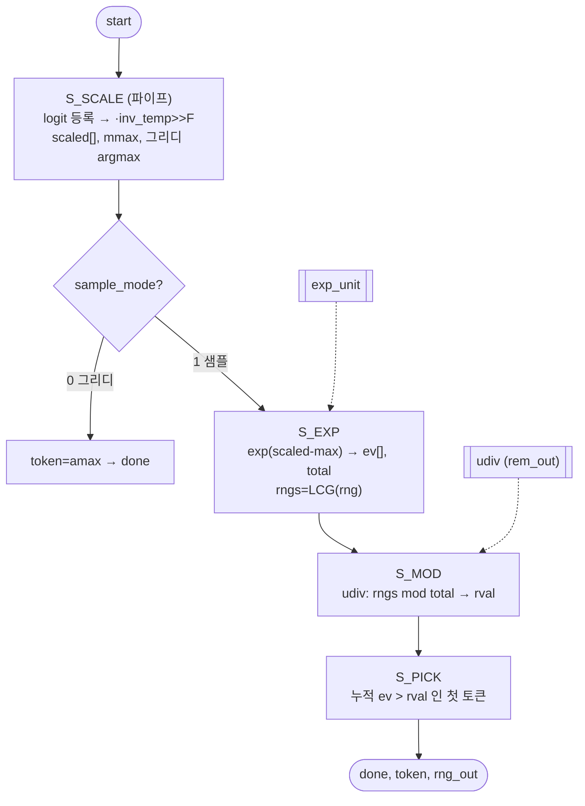

# `sampler.v` 분석

## 개요

`sampler.v`는 **토큰 샘플러**입니다. vmem에서 VOCAB개 logits를 읽습니다(등록 읽기 → read-ahead).
- `sample_mode=0` → **argmax**(그리디).
- `sample_mode=1` → **온도 softmax 범주형**: `scaled = logit/temp`, max+exp+sum으로 softmax,
  `r = LCG(rng) mod total`을 뽑아 누적 합이 처음으로 r을 초과하는 토큰을 선택.

`tools/fixedpoint.generate`와 비트 단위로 일치. 토큰 + 진행된 LCG를 방출합니다.

## 블록 다이어그램

## 인터페이스

| 신호 | 역할 |
|---|---|
| `sample_mode`, `inv_temp`, `rng_in` | 모드/온도(Q11)/RNG 시드 |
| `lm_base`, `v_raddr`, `v_rdata` | logits 읽기 |
| `token`, `rng_out` | 선택 토큰 + 진행된 LCG |

## 핵심 설계 포인트

- **가변 온도**: `inv_temp`가 로터리 선택으로 가변이므로 logit을 먼저 등록(`logit_r`) →
  16×16 곱셈이 fabric 레지스터에서 시작, BRAM 출력 넷을 크리티컬 패스에서 제거.
- **udiv로 모듈로**: 나눗셈기가 이미 나머지(`rem_out`)를 생성하므로 별도 `q*total` 곱셈이 불필요.
- **LCG**: `rng*1664525 + 1013904223`(Numerical Recipes 상수).

## FSM

`S_IDLE → S_SCALE → (그리디 종료 | S_EXP → S_MOD → S_PICK) → S_IDLE`

## RTL과의 관계
`microgpt_core`가 `OP_SAMPLE`에서 호출. `exp_unit`, `udiv`에 의존. 그리디/샘플 모두
Python `generate`와 비트 일치해야 하며, `tb_core.v`가 greedy `alaya`, sampled `rosphod`로 검증.
