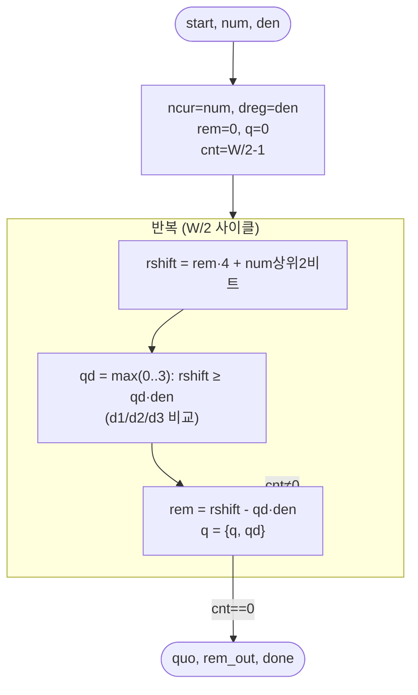

# `udiv.v` 분석

## 개요

`udiv.v`는 **부호 없는 반복 나눗셈기**입니다: `quo = num / den`(floor), W비트.
**Radix-4 복원(restoring), MSB 우선, 사이클당 몫 2비트** → W/2 사이클(W는 짝수).
`den == 0`이면 all-ones(가드). RMSNorm(`ss/N`, `2²²/r`)과 어텐션(가중합/softmax-합)이 공유하며,
샘플러는 `rem_out`(나머지)을 사용. radix-2 나눗셈기와 비트 동일한 floor 몫/나머지를 절반 사이클에 생성.
합성 가능(`/` 연산자 없음).

## 블록 다이어그램

## 인터페이스

| 신호 | 역할 |
|---|---|
| `num`, `den` (W비트) | 피제수/제수 |
| `quo` (W비트) | floor 몫 |
| `rem_out` (W비트) | num mod den (done과 함께 유효) |
| `busy`, `done` | 상태 |

## 핵심 설계 포인트

- **Radix-4 몫 자릿수**: `d1=den`, `d2=2·den`, `d3=3·den`을 미리 계산해 `rshift`와 비교,
  {0,1,2,3} 중 최대 자릿수 `qd` 선택 → 사이클당 2비트.
- **den==0 가드**: all-ones로 대체해 0 나눗셈 방지.
- **정확한 floor**: 정수 연산만으로 Python 레퍼런스와 비트 동일.

## RTL과의 관계
`norm`(2회), `attn`(HEAD_DIM개 병렬 인스턴스), `sampler`(모듈로)가 사용. 스테이지 5에서
radix-2 → radix-4로 전환해 51,914 tok/s 달성. `tb_mathops.v`가 검증.
