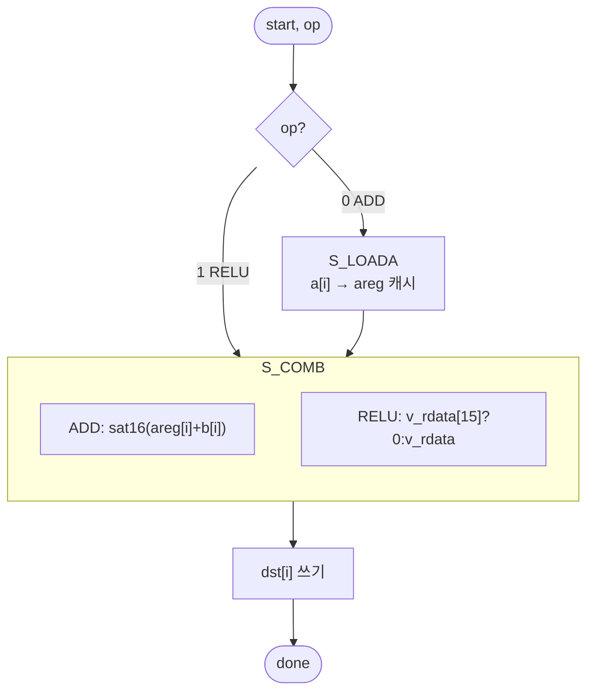

# `vecop.v` 분석

## 개요

`vecop.v`는 vmem 상의 **원소별 벡터 연산**입니다(등록 읽기 → read-ahead):
- `op=0` **ADD**: `dst[i] = sat16(a[i] + b[i])` (잔차 덧셈)
- `op=1` **RELU**: `dst[i] = max(0, a[i])` (MLP 활성화)

ADD는 벡터 a를 로컬 캐시에 읽어들인 뒤(read-ahead) b를 스트리밍하며 a+b를 씁니다.
RELU는 a를 스트리밍하며 max(0,a)를 씁니다. `cnt`는 최대 MLP 폭(96)까지.

## 블록 다이어그램

## 인터페이스

| 신호 | 역할 |
|---|---|
| `op`, `a_base`, `b_base`, `dst_base`, `cnt` | 연산/피연산자/개수 |
| `v_raddr`, `v_rdata`, `v_we`, `v_waddr`, `v_wdata` | vmem 읽기/쓰기 |

## 핵심 설계 포인트

- **read-ahead 주소 먹스**: `S_LOADA`면 `a_base+fi`, RELU면 `a_base+fi`, ADD 계산 시 `b_base+fi`.
- **로컬 캐시 `areg[0:95]`**: ADD에서 a를 먼저 읽어 b 스트림과 정렬.
- **RELU는 캐시 생략**: `S_COMB`로 직행.

## FSM

`S_IDLE → (ADD: S_LOADA →) S_COMB → S_IDLE`

## RTL과의 관계
`microgpt_core`가 `OP_VADD`(잔차 2회)와 `OP_RELU`(MLP)에서 호출. 어텐션 출력 잔차와
MLP 잔차, fc1 이후 ReLU를 담당.
