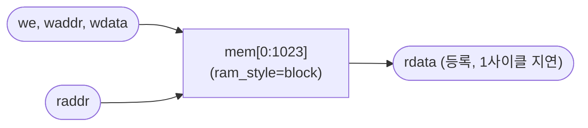

# `vmem.v` 분석

## 개요

`vmem.v`는 **활성값 스크래치패드**로, Block RAM 기반 **1 쓰기 포트 + 1 등록 읽기 포트**입니다.
등록 읽기(rdata는 raddr 1사이클 뒤 유효)는 읽기 주소 팬아웃을 작게 유지합니다(단일 BRAM 대 분산 RAM의
~256개 LUT-RAM 프리미티브) — 이것이 지배적 라우팅 지연이었습니다. 액추에이터는 주소를 한 사이클 먼저
제시하고 다음 사이클에 데이터를 소비합니다(read-ahead).

## 블록 다이어그램

## 인터페이스

| 신호 | 역할 |
|---|---|
| `we`, `waddr`, `wdata` | 쓰기 포트 |
| `raddr`, `rdata` | 등록 읽기 포트(1사이클 지연) |

## 핵심 설계 포인트

- **단일 등록 읽기 포트**: 분산 RAM 대비 팬아웃/라우팅 지연 대폭 감소(스테이지 1 타이밍 재작업).
- **`(* ram_style = "block" *)`**: BRAM 추론.

## `vmem2`와의 관계
`vmem`은 단일 읽기 포트 버전(초기/단순 액추에이터 테스트벤치용), `vmem2`는 진정한 듀얼 포트 버전
(현재 코어가 사용). `tb_attn.v`는 `vmem`을, `tb_matvec.v`/`tb_norm.v`는 `vmem2`를 사용합니다.

## RTL과의 관계
스테이지 1에서 분산 RAM → 등록 읽기 BRAM 전환으로 33 MHz → 80 MHz 보드 클로징을 달성한 기반.
이후 스테이지 7에서 `vmem2`(듀얼 포트)로 발전.
