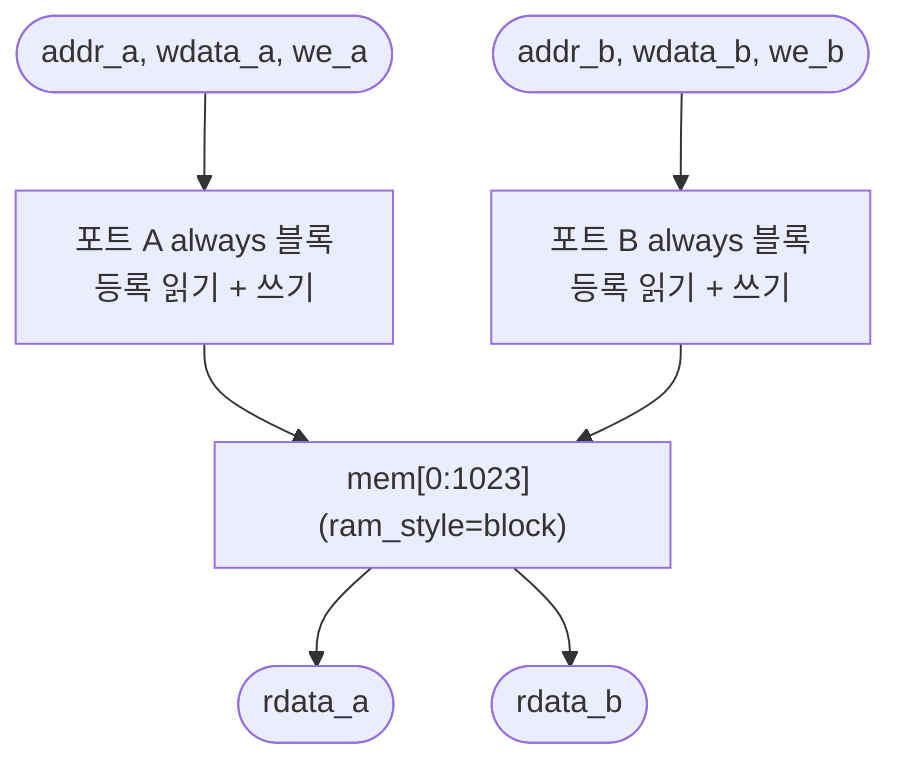

# `vmem2.sv` 분석

## 개요

`vmem2.sv`는 **활성값 스크래치패드**로, Block RAM 기반 **진정한 듀얼 포트**입니다. 두 독립 포트(A, B)가
각각 매 사이클 읽기를 등록(rdata는 addr 1사이클 뒤 유효)하고, `we`가 어서트되면 씁니다.
이로써 사이클당 두 메모리 접근이 가능 — 두 읽기(RMSNorm 제곱합, 어텐션 점수/가중합), 두 쓰기
(RMSNorm 스케일, matvec 라이트백), 또는 기존의 한 읽기+한 쓰기. 호출자는 한 사이클에 두 포트로
같은 주소를 쓰면 안 됩니다. 1024×16은 진정한 듀얼 포트 모드에서 하나의 RAMB18에 들어갑니다.

## 블록 다이어그램

## 인터페이스

| 신호 | 역할 |
|---|---|
| `we_a/b`, `addr_a/b`, `wdata_a/b` | 포트별 쓰기/주소 |
| `rdata_a/b` | 포트별 등록 읽기(1사이클 지연) |

## 핵심 설계 포인트

- **포트당 하나의 `always` 블록**: XST 진정한 듀얼 포트 BRAM 템플릿. 두 포트를 한 블록에 넣으면
  XST가 플립플롭으로 폴백(BRAM 미추론) — 이것이 46.7k LUT 폭증의 원인이었고, 포트 분리로 16.7k로 감소.
- **`(* ram_style = "block" *)`**: BRAM 추론 강제.

## RTL과의 관계
`microgpt_core`의 공유 스크래치패드(작업셋 0..255 + KV 캐시 256..1023). `matvec`/`norm`이 듀얼 포트를
활용해 2원소/사이클 처리. `tb_matvec.sv`, `tb_norm.sv`가 이 모듈을 사용. 스테이지 7~8 최적화의 핵심.
