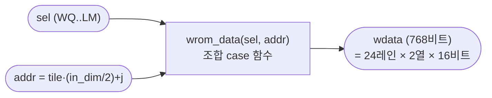

# `wrom.sv` 분석

## 개요

`wrom.sv`는 24-레인, 2열/사이클 병렬 matvec 엔진을 위한 **와이드 가중치 ROM**입니다.
각 워드는 연속된 **두 입력 열**(하위 절반 = 열 2j, 상위 절반 = 열 2j+1)에 대한 LANES=24개
Q5.11 가중치를 담으며, `tile*(in_dim/2) + j`로 주소 지정됩니다.
`wdata[lane*16 +:16]`은 열 2j, `wdata[LANES*16 + lane*16 +:16]`은 열 2j+1의 가중치입니다.

## 블록 다이어그램

## 인터페이스

| 신호 | 역할 |
|---|---|
| `sel` (3비트) | 가중치 행렬 선택 (WQ/WK/WV/WO/FC1/FC2/LM) |
| `addr` (12비트) | 타일-워드 주소 |
| `wdata` (768비트) | 두 열의 LANES개 가중치 |

## 핵심 설계 포인트

- **조합 case 함수**: 내용은 `$readmemh`가 아닌 `core/wrom_data.vh`의 `wrom_data` case 함수.
  XST 14.7이 작은 `$readmemh` ROM을 0으로 묶어 보드에서 쓰레기 이름을 냈기 때문. 명시적 상수는
  LUT로 신뢰성 있게 합성됨.
- **패킹**: `export.py`의 `_tiled_words`/`write_tiled_hex`와 동일한 규칙(열 2j 하위, 2j+1 상위, 레인 0=LSB).

## RTL과의 관계
`matvec`이 `w_addr`로 조회하고 `w_rdata`를 받음. `wrom_data.vh`는 `export.py`가 생성.
`tb_matvec.sv`에서 WQ(sel=0)로 인스턴스화되어 검증.
