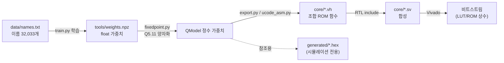
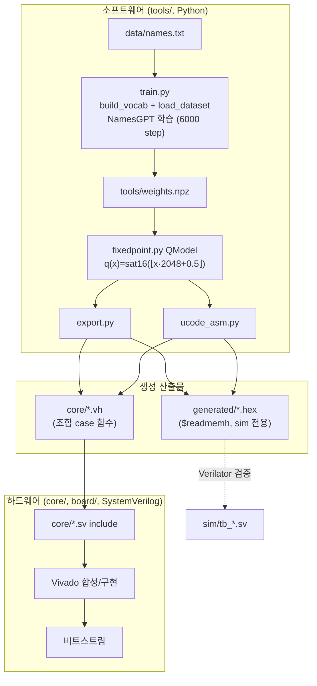
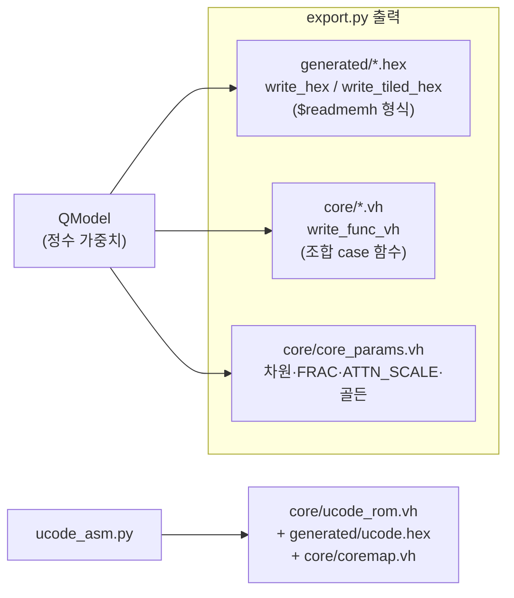
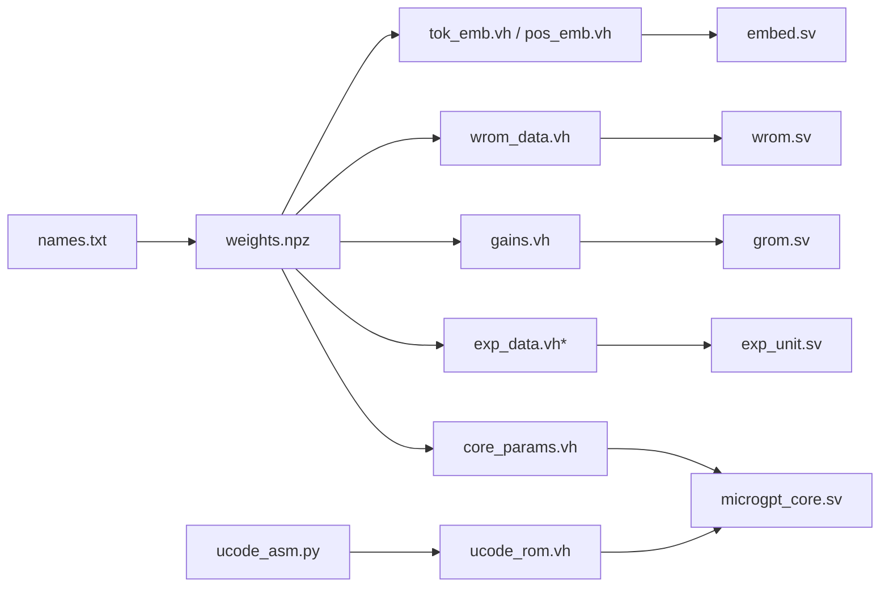

# `names.txt` → RTL 삽입 과정 분석

## 0. 요약 (TL;DR)

`data/names.txt`(이름 32,033개)는 **RTL에 직접 삽입되지 않습니다.** 텍스트는 학습을
거쳐 **부동소수점 가중치**가 되고, 그 가중치가 **Q5.11 고정소수점 상수**로 양자화되어
Verilog **조합 ROM 함수**(`core/*.vh`)로 방출된 뒤, RTL 모듈이 `` `include ``로 흡수하고
합성 시 LUT/ROM으로 구워져 비트스트림에 박힙니다.

정리하면 **`names.txt` → (학습) → 가중치 숫자 → (양자화) → ROM 상수 → (합성) → 비트스트림**
이며, 파일 자체나 이름 텍스트가 하드웨어에 들어가는 경로는 없습니다.



---

## 1. 전체 파이프라인



---

## 2. 단계별 상세

### 2.1 [1단계] 어휘 정의 + 토큰화 — `train.py`

`names.txt`의 원문은 소문자 이름들입니다(`emma`, `olivia`, …). RTL은 텍스트가 아니라
**고정된 27개 토큰 ID**로만 동작하므로, 학습 단계에서 문자를 정수로 매핑합니다.

```python
# build_vocab(): 어휘는 저장소에 하드코딩(names.txt에서 유도되지 않음)
chars = ["."] + [chr(ord("a") + i) for i in range(26)]   # '.', a..z
stoi = {c: i for i, c in enumerate(chars)}                # 0='.', 1='a' .. 26='z'
```

각 이름은 구분자 `.`로 감싸 **`.name.`** 시퀀스로 토큰화되고, `block_size=16`으로
우측 패딩 + 손실 마스킹됩니다. 예: `emma` → `. e m m a .` → `[0,5,13,13,1,0]`.

> **핵심:** 어휘(`.`, `a`..`z`)는 **고정 상수**입니다. `names.txt`에 어떤 이름이 있든
> 알파벳 집합은 27개로 동일하며, 이 매핑은 RTL이 아니라 소프트웨어(학습/샘플링)에만 존재합니다.

### 2.2 [2단계] 학습 → `weights.npz` — `train.py` + `model.py`

`names.txt`의 "지식"이 실제로 흡수되는 유일한 단계입니다. 디코더 전용 트랜스포머
1블록(`NamesGPT`)을 AdamW로 6000 step 학습하여 float 가중치를 저장합니다.

| 학습되는 텐서 | 의미 |
|---|---|
| `tok_embed`(27×24), `pos_embed`(16×24) | 토큰·위치 임베딩 |
| `wq/wk/wv/wo`(24×24) | 어텐션 투영 |
| `fc1`(96×24), `fc2`(24×96) | MLP |
| `lm_head`(27×24) | 로짓 투영 |
| `norm1/2/f.gain`(24) | RMSNorm 게인 |

```python
sd = {k: v.detach().cpu().numpy() for k, v in model.state_dict().items()}
np.savez(os.path.join(HERE, "weights.npz"), **sd)   # -> tools/weights.npz
```

이 시점부터 `names.txt`는 더 이상 등장하지 않습니다. 이후 모든 단계는 `weights.npz`만
사용합니다.

### 2.3 [3단계] 고정소수점 양자화 (Q5.11) — `fixedpoint.py`

`QModel`이 `weights.npz`를 읽어 모든 값을 **부호 있는 16비트 Q5.11**(정수 5비트,
소수 11비트, `FRAC=11`, 스케일 `2¹¹=2048`)로 양자화합니다. 이 정수 표현이 RTL과
**비트 단위로 동일**해야 하는 기준 스펙입니다.

```python
FRAC, SCALE = 11, 1 << 11          # 2048
def q(x):                           # float -> Q5.11 포화 int16 (반올림)
    return sat16(int(math.floor(x * SCALE + 0.5)))
```

예: 게인 `1.04150…` → `round(1.04150·2048)=2133` → `16'sh0855`(실제 `gains.vh` 첫 항목).
어텐션 스케일 `1/√6 ≈ 0.40825` → `round(0.40825·2048)=836` → `ATTN_SCALE = 836`.

### 2.4 [4단계] ROM 방출 — `export.py`, `ucode_asm.py`

양자화된 정수를 두 가지 형식으로 내보냅니다.



**두 ROM 계열의 차이(중요):**

| 계열 | 형식 | 용도 |
|---|---|---|
| `generated/*.hex` | `$readmemh` 로드용 16진 텍스트 | **시뮬레이션/레퍼런스 전용** |
| `core/*.vh` | Verilog **조합 case 함수** 상수 | **실제 RTL이 include** → 합성 대상 |

> RTL이 `.hex`가 아니라 `.vh` 상수 함수를 쓰는 이유: **원래 ISE/XST 14.7이 작은 `$readmemh`
> 분산 ROM을 0으로 묶어버려**(보드에서 가중치가 전부 0 → 쓰레기 이름), 명시적 case 상수로
> 바꿔 LUT에 확실히 굽도록 했습니다. 이 구조를 Vivado 흐름에서도 그대로 유지합니다.

**`write_func_vh`가 만드는 조합 함수** (예: 임베딩):

```verilog
// core/tok_emb.vh (자동 생성) -- 실제 첫 항목들
function signed [15:0] tok_emb;
    input [9:0] idx;
    case (idx)
        10'd0: tok_emb = 16'h0181;
        10'd1: tok_emb = 16'h0172;
        10'd2: tok_emb = 16'hfc53;
        ...
    endcase
endfunction
```

**가중치 타일 패킹**(`write_tiled_hex` / `wrom_data`): matvec 엔진이 **24레인 병렬,
사이클당 2열**을 소비하므로, 한 ROM 워드에 연속된 두 입력 열(2j, 2j+1)의 24개 가중치
(총 48개 = 2·24·16 = 768비트)를 담고 `tile·(in_dim/2)+j`로 주소 지정합니다. `wrom_data`는
2단계 함수(`sel`로 가중치 행렬 선택, `addr`로 워드 선택)입니다.

**마이크로코드**(`ucode_asm.py`): 코어의 제어 프로그램(17개 명령: EMBED→NORM→MATV(K/V/Q)
→ATTN→…→SAMPLE→HALT)을 `ucode_rom.vh` 조합 함수로 방출하고, 메모리 맵/opcode를
`coremap.vh`에 냅니다. 이건 `names.txt`와 무관한 **고정 스케줄**입니다.

### 2.5 [5단계] RTL include + 합성

각 코어 모듈이 해당 `.vh`를 `` `include ``하여 ROM 함수를 자기 안에 인스턴스화합니다.

| RTL 모듈 | `include` 하는 `.vh` | 역할 |
|---|---|---|
| `core/embed.sv` | `tok_emb.vh`, `pos_emb.vh` | `emb[i]=sat16(tok_embed[token][i]+pos_embed[pos][i])` |
| `core/wrom.sv` | `wrom_data.vh` | `wdata = wrom_data(sel, addr)` (타일 가중치) |
| `core/exp_unit.sv` | `exp_data.vh` | softmax용 exp 테이블 |
| `core/grom.sv` | `gains.vh` | RMSNorm 게인 |
| `core/microgpt_core.sv` | `ucode_rom.vh`, `coremap.vh`, `core_params.vh` | 마이크로코드·맵·차원 |

예 (`embed.sv`):

```systemverilog
`include "tok_emb.vh"
`include "pos_emb.vh"
wire signed [16:0] sum = $signed(tok_emb(tbase + i)) + $signed(pos_emb(pbase + i));
```

Vivado 합성 시 이 case 함수 상수들이 **LUT/분산 ROM**으로 구현되어 비트스트림에 고정
삽입됩니다. 이 지점이 바로 "`names.txt`에서 학습된 값이 하드웨어에 박히는" 순간입니다.

### 2.6 [6단계] 보드 실행 — 토큰 → 문자

런타임에 RTL은 **토큰 ID**를 생성합니다(`sampler`가 로짓에서 다음 토큰 선택). 문자
변환은 다시 RTL 쪽에서 일어나되, 어휘가 고정이므로 단순 오프셋입니다.

```
board/name_generator.sv:  name_buf는 (token-1)을 저장 → 0..25 → 'a'..'z'
LCD 표시 문자 = 8'd97('a') + (token - 1)
```

즉 ROM에 든 것은 **가중치뿐**이고, "글자"는 `token=0`→종료(`.`), `token=k`→`'a'+k-1`
규칙으로 하드웨어에서 산출됩니다.

---

## 3. 파일 대응표 (한눈에)



\* `exp_data.vh`는 `exp(-k)` 수학 테이블이라 엄밀히는 `names.txt`가 아니라 수식에서 나옵니다
(가중치와 같은 방식으로 방출될 뿐).

| 데이터 종류 | `names.txt` 유래? | 최종 RTL 위치 |
|---|---|---|
| 임베딩/어텐션/MLP/LM 가중치 | **예** (학습) | `wrom_data.vh`, `tok_emb.vh`, `pos_emb.vh` |
| RMSNorm 게인 | **예** (학습) | `gains.vh` |
| exp 테이블 | 아니오 (수식) | `exp_data.vh` |
| 마이크로코드/메모리맵 | 아니오 (고정 스케줄) | `ucode_rom.vh`, `coremap.vh` |
| 차원/FRAC/어텐션 스케일 | 일부 (스케일=1/√6) | `core_params.vh` |
| 어휘/문자 매핑 | 아니오 (고정) | RTL 상수(`'a'+token-1`) |

---

## 4. `names.txt`를 바꾸면?

파일을 교체해도 자동 반영되지 않습니다. **재학습 → 재방출 → 재합성**이 필요합니다.

```bash
# 1) 새 코퍼스로 재학습 -> weights.npz 갱신
python tools/train.py

# 2) 가중치/마이크로코드를 RTL 상수로 재방출 -> core/*.vh, generated/*.hex 갱신
python tools/export.py
python tools/ucode_asm.py

# 3) (선택) 시뮬레이션으로 비트 일치 확인
make -C sim            # Verilator, 전 테스트벤치 PASS

# 4) 비트스트림 재빌드
vivado -mode batch -source build_board_vivado_project.tcl
```

> 어휘 자체(문자 집합)를 바꾸려면(예: 대문자/숫자 추가) `train.py`의 `build_vocab`와
> `VOCAB`/임베딩 크기, 그리고 토큰→문자 변환 RTL까지 함께 수정해야 합니다.

---

## 5. 자주 묻는 것

- **Q. `names.txt`의 이름 문자열이 ROM 어딘가에 저장되나요?**
  아니요. 어떤 이름 문자열도 RTL/비트스트림에 없습니다. 학습으로 얻은 **가중치 숫자만**
  들어갑니다. 보드는 이름을 "저장·재생"하는 게 아니라 매번 **생성**합니다.

- **Q. 그럼 보드가 만드는 이름이 `names.txt`에 있던 이름인가요?**
  꼭 그렇진 않습니다. 학습된 분포에서 문자 단위로 **새로** 생성하므로 코퍼스에 없는
  이름도 나옵니다(골든: greedy `alaya`, sample seed 2·T=0.7 `rosphod`).

- **Q. `generated/*.hex`는 왜 있나요?**
  Verilator 시뮬레이션과 사람이 읽는 레퍼런스용입니다. 실제 합성 RTL은 `core/*.vh`
  조합 case 함수를 씁니다(§2.4의 XST 이력 참고).

- **Q. 데이터가 "박히는" 정확한 순간은?**
  §2.5 — Vivado가 `.vh` case 상수를 LUT/ROM으로 합성해 비트스트림에 고정하는 시점입니다.
