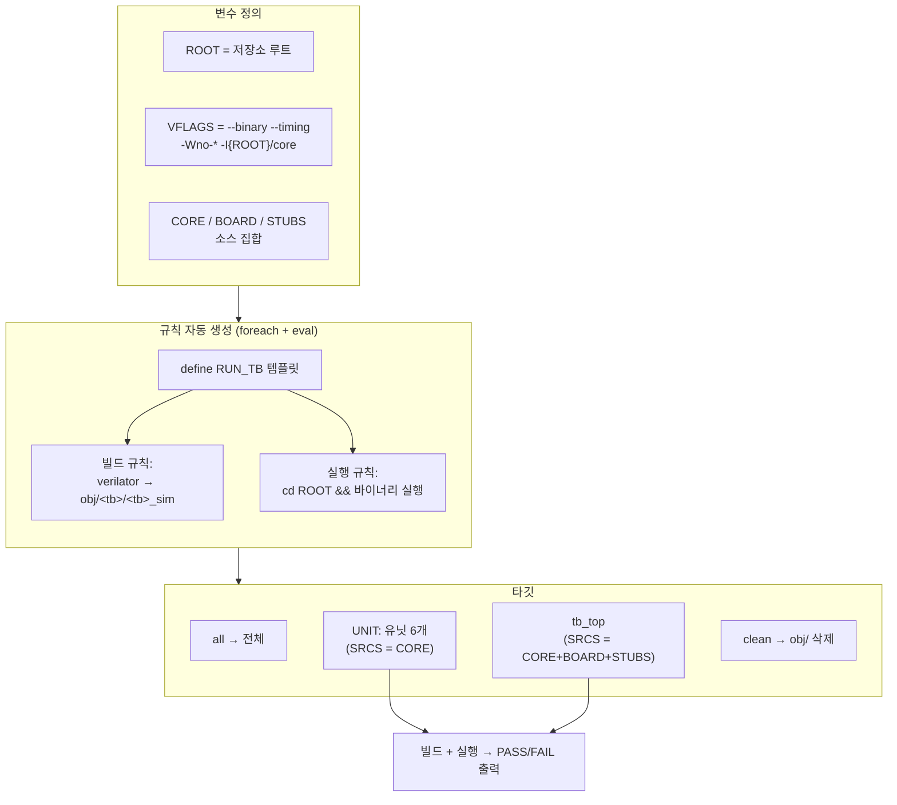

# `Makefile` 분석 (`sim/Makefile`)

## 개요

`sim/Makefile`은 gateGPT의 RTL 테스트벤치를 **Verilator**로 빌드·실행하는 빌드 스크립트입니다.
기존 iSim 골든 테스트벤치를 그대로 사용하며, `--binary --timing` 모드로 각 Verilog 테스트벤치를
네이티브 실행 파일로 컴파일한 뒤 저장소 루트에서 실행합니다.

주요 기능:
- 유닛 테스트벤치 6개(`tb_mathops`, `tb_exp`, `tb_matvec`, `tb_norm`, `tb_attn`, `tb_core`)와
  보드 최상위 테스트벤치 1개(`tb_top`)를 대상으로 함.
- 각 타깃마다 **빌드 규칙**(Verilator → 바이너리)과 **실행 규칙**(루트에서 실행)을 자동 생성.
- 테스트벤치별로 필요한 소스 집합(코어 전용 vs 코어+보드+stub)을 구분.

## 블록 다이어그램



## 사용법

```bash
make -C sim            # 모든 테스트벤치 빌드 + 실행 (유닛 6개 + 보드 TOP)
make -C sim tb_core    # 하나만 빌드 + 실행
make -C sim tb_top     # 보드 최상위 시뮬레이션
make -C sim lint       # 정적 lint만 수행(-Wall), 빌드/실행 없음
make -C sim clean      # 빌드 산출물(obj/, logs/) 삭제
```

**요구 사항**: Verilator ≥ 5.006 (`--binary`, `--timing` 필요). 설치: `sudo apt-get install verilator`.

## 변수 (Variables)

| 변수 | 값 / 역할 |
|---|---|
| `ROOT` | 저장소 루트 = Makefile 디렉터리(`sim/`)의 부모. `$(abspath $(dir $(lastword $(MAKEFILE_LIST)))/..)`로 계산 |
| `VERILATOR` | `verilator` (환경에서 `?=`로 오버라이드 가능) |
| `WAIVER` | `sim/gategpt.vlt` — Verilator lint waiver 파일(검토된 의도적 경고 억제) |
| `VFLAGS` | `--binary --timing -Wall $(WAIVER) -I$(ROOT)/core` (빌드) |
| `LINTFLAGS` | `--lint-only --timing -Wall $(WAIVER) -I$(ROOT)/core` (lint) |
| `CORE` | `core/*.v` 전체 (`$(wildcard ...)`) |
| `BOARD` | `board/*.v` 전체 |
| `STUBS` | `sim/xilinx_stubs.v` (Xilinx 프리미티브 stub) |
| `OBJDIR` | `sim/obj` (빌드 산출물 디렉터리, gitignore 대상) |
| `LOGDIR` | `sim/logs` (테스트벤치별 실행 로그 디렉터리, gitignore 대상) |
| `STAMP` | `$(shell date ...)` — make 시작 시 1회 평가되는 타임스탬프(로그 헤더용) |

### `VFLAGS`/`LINTFLAGS` 플래그 설명

| 플래그 | 의미 |
|---|---|
| `--binary` | Verilog 테스트벤치를 네이티브 실행 파일로 컴파일(각 `tb_*.v`가 자체 top) |
| `--lint-only` | 빌드 없이 정적 검사만 수행(lint 타깃) |
| `--timing` | `#delay`, `wait()`, `@(negedge clk)`, `always #5` 등 이벤트/타이밍 구문 지원(Verilator 5.x) |
| `-Wall` | 모든 경고 활성화(엄격) — waiver로 걸러진 것만 통과 |
| `$(WAIVER)` | `sim/gategpt.vlt` — 검토된 의도적 경고 범주를 waive(RTL 미수정) |
| `-I$(ROOT)/core` | 코어의 `` `include "*.vh" `` (마이크로코드/가중치/exp/임베딩 ROM) 검색 경로 |

### `sim/gategpt.vlt` (lint waiver)

RTL을 전혀 건드리지 않고 lint를 완전히 깨끗하게 유지하기 위한 Verilator 공식 waiver 파일입니다.
`WIDTHEXPAND`/`WIDTHTRUNC`(의도된 넓은 고정소수점 중간 표현식), `PINCONNECTEMPTY`/`PINMISSING`
(미사용 예비 핀·`udiv.rem_out`), `UNUSEDSIGNAL`/`UNUSEDPARAM`, `BLKSEQ`(함수 내 블로킹),
`SYNCASYNCNET`(DCM 비동기 리셋), `VARHIDDEN`, `TIMESCALEMOD`, `DECLFILENAME`,
`UNSIGNED`(LCD의 CLK_HZ 파생 임계값) 범주를 각각 주석과 함께 waive합니다. Verilator 전용이며 ISE 합성엔 무영향.

## 타깃 그룹 (Targets)

| 그룹/타깃 | 소스 집합 | 설명 |
|---|---|---|
| `UNIT` | `CORE` | 유닛/코어 테스트벤치 6개 |
| `TOP` (`tb_top`) | `CORE + BOARD + STUBS` | 보드 최상위 시뮬레이션 |
| `TESTS` | — | `UNIT + TOP` (전체) |
| `all` | — | 모든 테스트벤치 빌드+실행 |
| `lint` | — | 보드 top + 7개 테스트벤치 top을 `-Wall`로 정적 검사(빌드/실행 없음) |
| `clean` | — | `OBJDIR`·`LOGDIR` 삭제 |

### `lint` 타깃

```make
lint:
	@set -e; \
	for spec in "xupv5_microgpt_top:$(BOARD) $(CORE) $(STUBS)" \
	            $(foreach t,$(TESTS),"$(t):$(ROOT)/sim/$(t).v $(SRCS_$(t))"); do \
	  top=$${spec%%:*}; srcs=$${spec#*:}; \
	  $(VERILATOR) $(LINTFLAGS) --top-module $$top $$srcs && echo clean; \
	done
```

- `set -e`로 하나라도 경고가 나면(새 lint 위반) 타깃이 **실패**합니다 → CI 게이트로 활용 가능.
- 각 top(합성 대상 보드 top + 7개 TB)을 개별 lint하여 사용되지 않는 경로까지 검사.

### 테스트벤치별 소스 매핑

```make
$(foreach t,$(UNIT),$(eval SRCS_$(t) := $(CORE)))   # 유닛 → 코어만
SRCS_$(TOP) := $(CORE) $(BOARD) $(STUBS)            # TOP → 코어+보드+stub
```

- 유닛 테스트는 `core/*.v`만 필요. 인스턴스화되지 않는 모듈은 Verilator가 자동 가지치기(prune).
- `tb_top`은 보드 모듈과 Xilinx stub까지 필요(클럭 프리미티브 모델).

## 규칙 자동 생성 (`define` + `foreach`/`eval`)

핵심 관용구: 각 테스트벤치마다 동일한 빌드/실행 규칙을 템플릿으로 찍어냅니다.

```make
define RUN_TB
$(1): $(OBJDIR)/$(1)/$(1)_sim
	@mkdir -p $(LOGDIR)                              # 로그 디렉터리 준비
	@cd $(ROOT) && { echo "### $(1)  $(STAMP)"; $(OBJDIR)/$(1)/$(1)_sim; } \
	    2>&1 | tee $(LOGDIR)/$(1).log                # 실행 + 터미널·로그 동시 출력(tee)
	@echo "  -> log saved to sim/logs/$(1).log"

$(OBJDIR)/$(1)/$(1)_sim: $(ROOT)/sim/$(1).v $(SRCS_$(1))
	@mkdir -p $(OBJDIR)/$(1)                         # 중첩 디렉터리 미리 생성
	$(VERILATOR) $(VFLAGS) --top-module $(1) --Mdir $(OBJDIR)/$(1) -o $(1)_sim \
	    $(ROOT)/sim/$(1).v $(SRCS_$(1))              # 빌드 규칙
endef

$(foreach t,$(TESTS),$(eval $(call RUN_TB,$(t))))    # 모든 타깃에 적용
```

| 요소 | 역할 |
|---|---|
| `define RUN_TB ... endef` | 파라미터 `$(1)`(테스트벤치 이름)로 규칙 두 개를 정의하는 다행 매크로 |
| `$(call RUN_TB,$(t))` | 매크로를 이름 `$(t)`로 전개 |
| `$(eval ...)` | 전개 결과를 실제 Makefile 규칙으로 주입 |
| `$(foreach t,$(TESTS),...)` | 모든 테스트벤치에 대해 반복 |

## 핵심 설계 포인트

- **로그 파일 생성**: 각 실행을 `tee $(LOGDIR)/<tb>.log`로 터미널과 로그 파일에 **동시 출력**하여,
  모든 시뮬레이션 전체 기록을 `sim/logs/<테스트벤치>.log`에 보존(타임스탬프 헤더 포함). `clean`이 함께 삭제.
  > **주의**: `LOGDIR` 값 뒤에 인라인 주석을 붙이면 후행 공백이 값에 포함되어 `tee`가 두 인자를 받게 되므로,
  > 주석은 별도 줄에 둡니다(Make의 `:=` 후행 공백 보존 특성).
- **루트에서 실행**: 컴파일된 바이너리를 `cd $(ROOT)`로 실행 → 테스트벤치의
  `$readmemh("generated/*.hex", ...)` 상대 경로가 해결됨.
- **`-I$(ROOT)/core`**: 코어가 참조하는 생성된 `.vh`(조합 case ROM)를 찾는 검색 경로.
- **`mkdir -p`**: Verilator의 `--Mdir`가 중첩 부모(`sim/obj`)를 자동 생성하지 못하는 문제를 회피.
- **테스트벤치별 소스 분리**: 유닛은 `CORE`만, `tb_top`은 보드+stub까지 — 최소 소스로 빌드.
- **경고 억제**: 비트 정확성이 검증된 RTL의 무해한 WIDTH/PINMISSING 경고를 억제해 출력을 깔끔하게 유지.

## 관련 파일과의 관계

- **테스트벤치**: `sim/tb_*.v` (7개) — 각각 자체 top 모듈.
- **stub**: `sim/xilinx_stubs.v` — `tb_top`의 Xilinx 프리미티브 모델.
- **골든 데이터**: `generated/*.hex`(유닛), `core/*.vh`(코어 ROM) — 런타임/컴파일 타임에 로드.
- **문서**: `sim/verilator.kr.md` — 전체 시뮬레이션 흐름과 이식성 변경 사항 안내.
