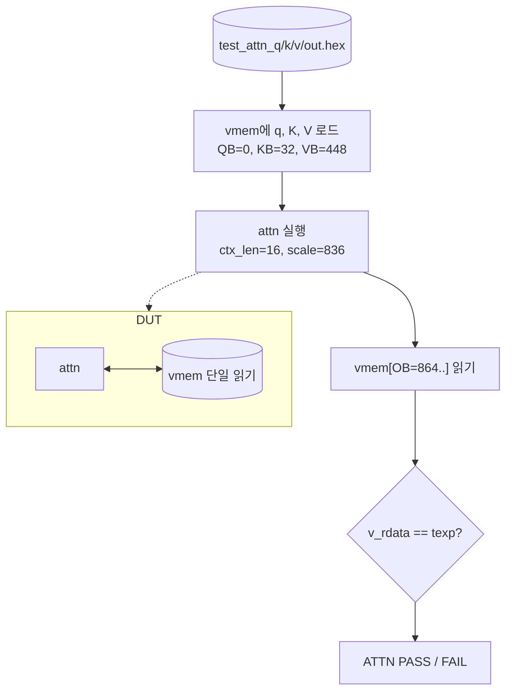

# `tb_attn.v` 분석

## 개요

`tb_attn.v`는 **어텐션 엔진 유닛 테스트**입니다(Python 레퍼런스 대비). q, K 캐시, V 캐시를 vmem에
로드하고 어텐션을 실행한 뒤, 24개 출력을 기대값과 비교합니다.

## 블록 다이어그램

## 주요 구성

| 요소 | 역할 |
|---|---|
| `u_vmem` (`vmem`) | 단일 읽기 포트 스크래치패드 |
| `u_attn` | DUT (N_EMBED=24, N_HEAD=4, HEAD_DIM=6, BLOCK=16) |
| `wload` 태스크 | q/K/V를 지정 베이스에 로드 |
| 베이스 | QB=0, KB=32, VB=448, OB=864 |

## 검증 흐름

1. `test_attn_q/k/v/out.hex` 로드.
2. `wload`로 q(24), K(16×24), V(16×24)를 vmem에 씀.
3. `start`로 어텐션 실행(attn_scale=836, ctx_len=16).
4. vmem[OB..OB+23] 리드백, `texp`와 비교.
5. 불일치 0이면 `ATTN PASS`.

## RTL과의 관계
`attn`(+`vmem`, 내부적으로 `exp_unit`/`udiv`)을 검증. 입력/기대값은 `dump_attn.py`가 생성
(`.saa` 컨텍스트). 헤드별 softmax + 가중합이 Python `attn_debug`와 비트 일치함을 확인.
