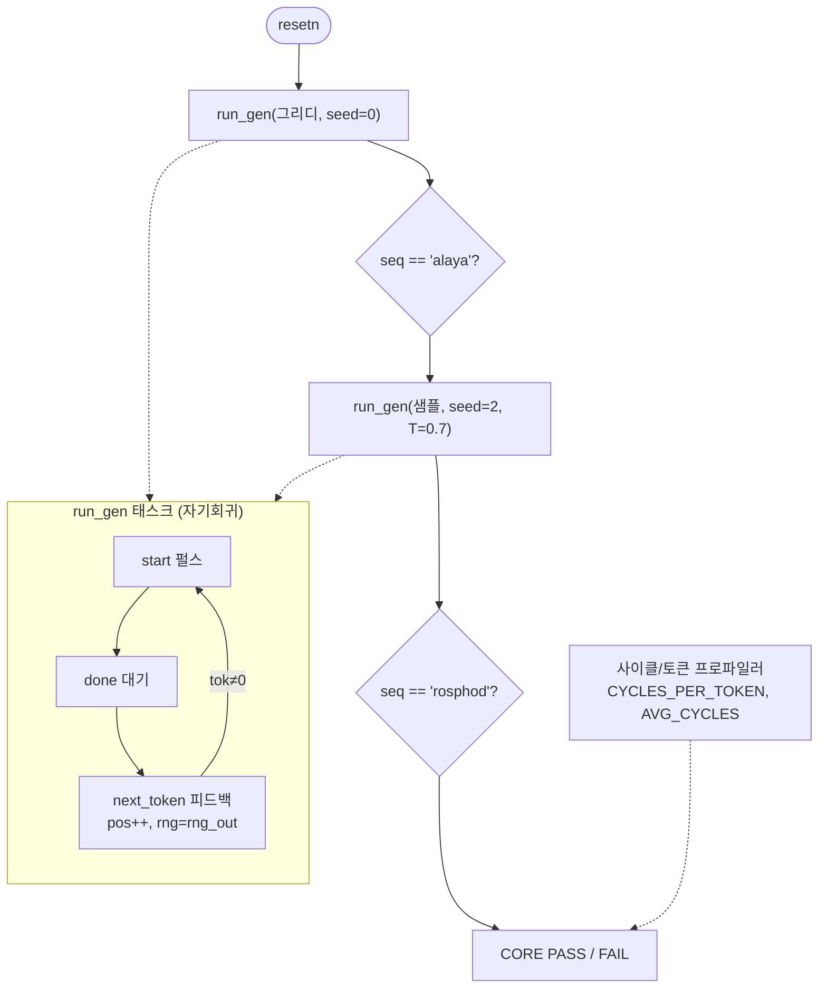

# `tb_core.sv` 분석

## 개요

`tb_core.sv`는 **엔드투엔드 코어 테스트**입니다. 증분 생성 루프(성장하는 절대 위치에서 코어 호출당
한 토큰, 영속적 KV 캐시)를 실행하고, 토큰 시퀀스를 Python 골든(그리디 + 샘플)과 비교합니다.

## 블록 다이어그램

## 주요 구성

| 요소 | 역할 |
|---|---|
| `u_core` | `microgpt_core` DUT |
| `run_gen(mode, seed, itemp)` | 자기회귀 생성 태스크 |
| 사이클 프로파일러 | start→done 사이클 측정, `CYCLES_PER_TOKEN`/`AVG_CYCLES` 출력 |
| `exp_greedy` | `alaya` = [1,12,1,25,1] |
| `exp_samp` | `rosphod` = [18,15,19,16,8,15,4] |

## 검증 흐름

1. 리셋 후 그리디 생성(seed=0) → 길이 5, `alaya`와 일치 검증.
2. 샘플 생성(seed=2, inv_temp=2926=1/0.7) → 길이 7, `rosphod`와 일치 검증.
3. 12토큰 이상 프로파일 후 평균 사이클 출력.
4. 에러 0이면 `CORE PASS`.

## RTL과의 관계
`microgpt_core` 전체 경로를 검증하는 최상위 골든 테스트(Verilator). Python `fixedpoint.generate`가
만든 시퀀스를 재현하는지 확인. README의 "iSim 오라클" 검증에 해당.
