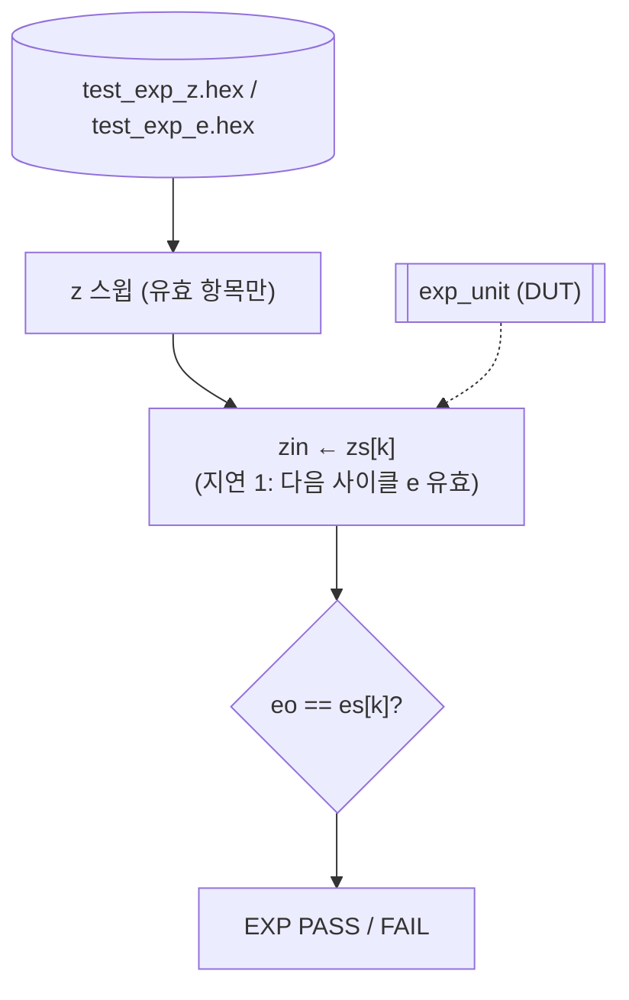

# `tb_exp.v` 분석

## 개요

`tb_exp.v`는 **`exp_unit` 유닛 테스트**입니다(Python 레퍼런스 대비, z 값 스윕).

## 블록 다이어그램

## 주요 구성

| 요소 | 역할 |
|---|---|
| `u_exp` (`exp_unit`) | DUT (지연 1) |
| `zs`, `es` | 입력 z / 기대 e (최대 M=102, 미사용 항목은 x) |

## 검증 흐름

1. 모든 항목을 x로 초기화(가변 개수 케이스 지원).
2. `test_exp_z.hex`(입력 z), `test_exp_e.hex`(기대 e) 로드.
3. 유효 항목(≠x)마다: `zin`에 z를 넣고 한 사이클 뒤 `eo`를 `es[k]`와 비교.
4. 불일치 0이면 `EXP PASS`.

## 핵심 포인트
- **지연 1 처리**: `exp_unit`이 입력을 내부 등록하므로 `@(posedge clk)` 후 `#1`에 결과 확인.
- **가변 케이스 수**: x 마킹으로 임의 개수의 스윕 케이스를 처리.

## RTL과의 관계
`exp_unit`을 검증. 입력/기대값은 `dump_test.py`의 exp 스윕이 생성(경계 케이스 포함).
Python `exp_neg_q11`과 비트 일치함을 확인.
