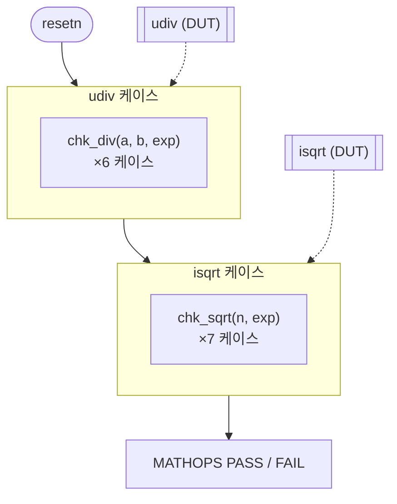

# `tb_mathops.v` 분석

## 개요

`tb_mathops.v`는 **`udiv`와 `isqrt` 유닛 테스트**입니다(Python 레퍼런스 값 대비).

## 블록 다이어그램

## 주요 구성

| 요소 | 역할 |
|---|---|
| `u_div` (`udiv`, W=48) | 나눗셈 DUT |
| `u_sqrt` (`isqrt`, W=48) | 제곱근 DUT |
| `chk_div(a,b,exp)` | 나눗셈 검증 태스크 |
| `chk_sqrt(n,exp)` | 제곱근 검증 태스크 |

## 검증 케이스

- **udiv**: 10962944/24=456789, 4194304/675=6213, 123456789/1000=123456, 65535/256=255, 1/1=1, 0/7=0.
- **isqrt**: √456789=675, √4194304=2048, √100=10, √10=3, √0=0, √1=1, √999999999=31622.

## 검증 흐름

각 태스크가 `start` 펄스 후 `done`을 기다려 결과를 기대값과 비교. 모두 통과하면 `MATHOPS PASS`.

## RTL과의 관계
`norm`/`attn`/`sampler`가 공유하는 산술 프리미티브(`udiv` radix-4, `isqrt` 비트-페어)를 검증.
Python `//`(floor)와 `math.isqrt`와 비트 일치함을 확인.
