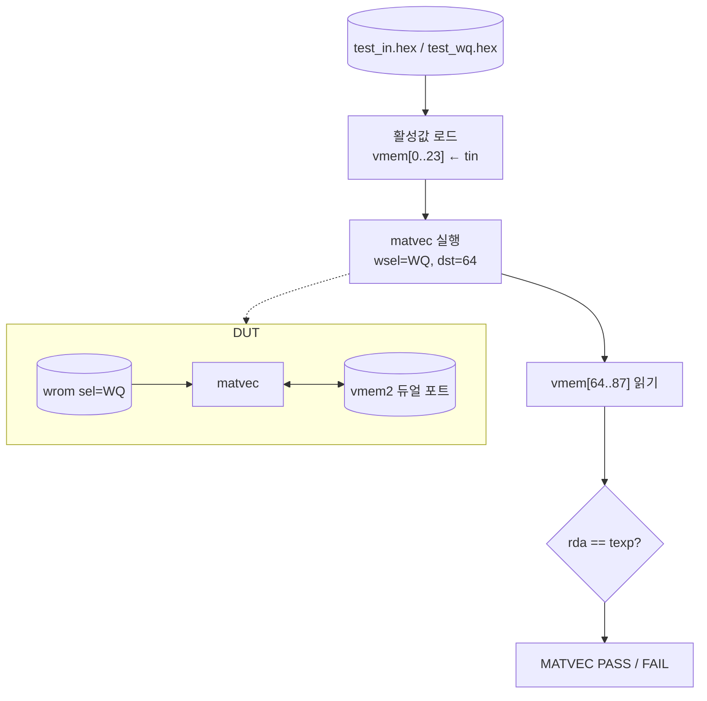

# `tb_matvec.sv` 분석

## 개요

`tb_matvec.sv`는 **matvec 엔진 유닛 테스트**입니다. 알려진 활성값 벡터를 로드하고 wq를 실행한 뒤,
24개 출력을 Python 고정소수점 레퍼런스와 비교합니다(듀얼 포트 vmem 사용).

## 블록 다이어그램

## 주요 구성

| 요소 | 역할 |
|---|---|
| `u_vmem` (`vmem2`) | 듀얼 포트 스크래치패드 |
| `u_wrom` (sel=WQ) | 타일 가중치 ROM |
| `u_mv` (`matvec`) | DUT |
| 포트 먹스 (`load`) | TB(로드/리드백) vs matvec(실행) 전환 |

## 검증 흐름

1. `test_in.hex`(입력), `test_wq.hex`(기대 = wq@input) 로드.
2. `load=1`로 vmem[0..23]에 입력 씀.
3. `load=0`, `start`로 matvec 실행(in_dim=24, out_dim=24, descale=11, dst=64).
4. `load=1`로 vmem[64..87] 리드백, 각 출력을 `texp`와 비교.
5. 불일치 0이면 `MATVEC PASS`.

## RTL과의 관계
`matvec`(+`wrom`, `vmem2`)를 검증. 입력/기대값은 `dump_test.py`가 생성. 병렬 MAC 타일이
Python `matvec`와 비트 일치함을 확인.
