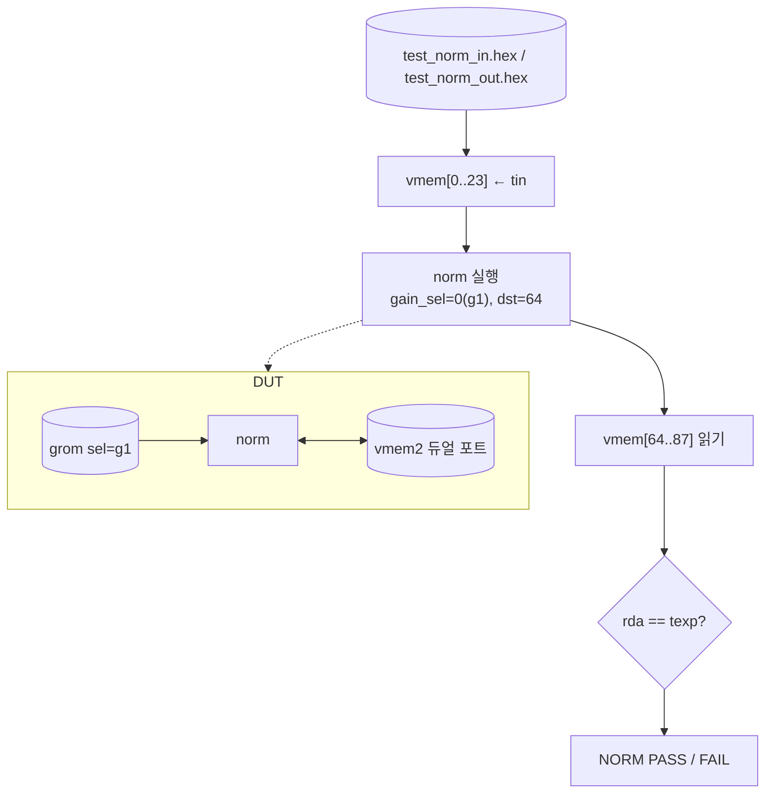

# `tb_norm.sv` 분석

## 개요

`tb_norm.sv`는 **RMSNorm 엔진 유닛 테스트**입니다(Python 고정소수점 레퍼런스 대비, 듀얼 포트 vmem).

## 블록 다이어그램

## 주요 구성

| 요소 | 역할 |
|---|---|
| `u_vmem` (`vmem2`) | 듀얼 포트 스크래치패드 |
| `u_grom` (sel=g1) | 게인 ROM |
| `u_norm` (`norm`) | DUT (N=24, FRAC=11) |
| 포트 먹스 (`load`) | TB vs norm 전환 |

## 검증 흐름

1. `test_norm_in.hex`(입력), `test_norm_out.hex`(기대) 로드.
2. vmem[0..23]에 입력 씀.
3. `start`로 RMSNorm 실행(src=0, dst=64, gain_sel=0).
4. vmem[64..87] 리드백, `texp`와 비교.
5. 불일치 0이면 `NORM PASS`.

## RTL과의 관계
`norm`(+`grom`, `vmem2`, 내부 `udiv`/`isqrt`)을 검증. 입력/기대값은 `dump_test.py`가 생성.
정수 isqrt + 역수 기반 RMSNorm이 Python `rmsnorm`과 비트 일치함을 확인.
