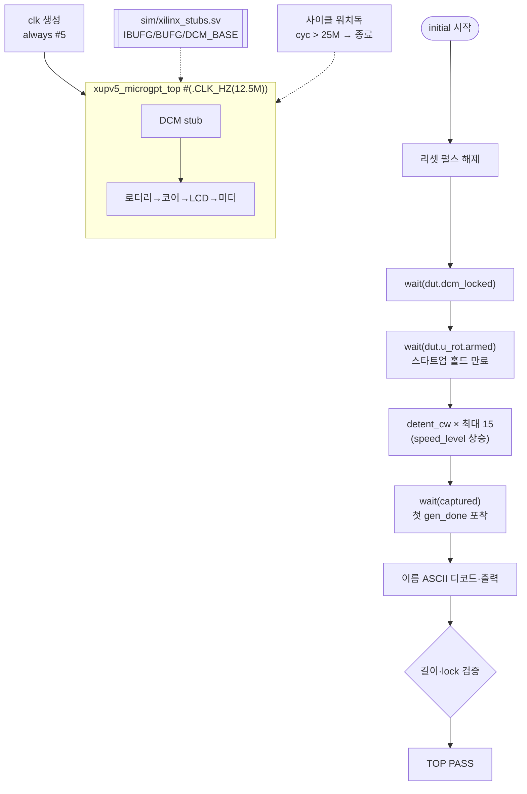

# `tb_top.sv` 분석

## 개요

`tb_top.sv`는 **보드 최상위(TOP) 테스트벤치**입니다 — `xupv5_microgpt_top` 전체(클럭 합성 →
리셋/버튼 디바운스 → 로터리 스로틀 → 이름 생성기(코어) → HD44780 LCD → 초당 토큰 미터)를
Xilinx UniSim 라이브러리 없이 Verilator/iverilog에서 시뮬레이션합니다.

TOP은 시뮬레이션용으로 축소된 `CLK_HZ`(`SIMCLK_HZ = 12.5 MHz`)로 인스턴스화되어 `CLK_HZ` 파생
실시간 지연을 시뮬레이션 가능한 사이클 수로 줄입니다. 흐름: 리셋 해제 → DCM lock 대기 →
로터리 스타트업 홀드 대기 → 엔코더를 시계방향 구동해 자동 회전 속도를 올림 → 첫 생성 이름을
포착·출력. 사이클 워치독으로 종료를 보장합니다.

## 블록 다이어그램



## 주요 구성

| 요소 | 역할 |
|---|---|
| `dut` | `xupv5_microgpt_top`, `#(.CLK_HZ(12_500_000))` 오버라이드 |
| `clk` | `always #5`로 생성(패스스루 DCM → 코어 클럭) |
| `rst_btn`/`start_btn`/`rot_*`/`dip_sw` | 보드 입력 자극 |
| `led`/`lcd_*` | 보드 출력 관찰 |
| `cyc` / `captured` / `cap_name` | 사이클 카운터 + 첫 이름 포착 래치 |
| `detent_cw` (task) | 쿼드러처 시계방향 1디텐트(`speed_level` +1) |

## 핵심 설계 포인트

- **`SIMCLK_HZ = 12.5 MHz` 하한**: LCD 셋업 지연 `SU_CYC = CLK_HZ/12.5M`이 0이 되면 LCD FSM이
  멈추므로 이 값 이상이어야 함.
- **로터리 구동**(`detent_cw`): 쿼드러처 `00→01→11→10→00` 시퀀스, 각 상태를 디글리치 FILTER(2500)보다
  긴 `HOLD=4000` 사이클 유지 → 깨끗한 단일 엣지로 `speed_level` 상승. 생성 간격 단축.
- **계층 참조(XMR)**: `dut.dcm_locked`, `dut.u_rot.armed`, `dut.u_rot.speed_level`,
  `dut.gen_done`, `dut.name_len`, `dut.name_flat`를 읽어 내부 상태를 관찰.
- **이름 디코드**: `name_buf`가 `token-1`을 저장하므로 문자 = `97 + name_flat[i]`.
- **워치독 + 자연 발사 안전망**: 로터리 구동이 완벽하지 않아도 1 Hz 자동 발사가 이름을 생성하고,
  25M 사이클 워치독이 무한 정지를 방지.

## 기대 출력

```
[cycle 38] DCM locked
[cycle 2600032] rotary armed, raising speed...
[cycle 2664031] speed_level=4
generated name: sivont   (len=6)
TOP PASS: board booted (DCM locked, LCD driving) and generated a name
```

## RTL과의 관계
`xupv5_microgpt_top`과 `sim/xilinx_stubs.sv`(Xilinx 프리미티브 stub)를 함께 사용. 보드 전체가
통합 동작(DCM lock, LCD 구동, 코어 자기생성)함을 검증. `make -C sim tb_top`으로 실행하며,
상세 안내는 `sim/verilator.kr.md` 참조.
