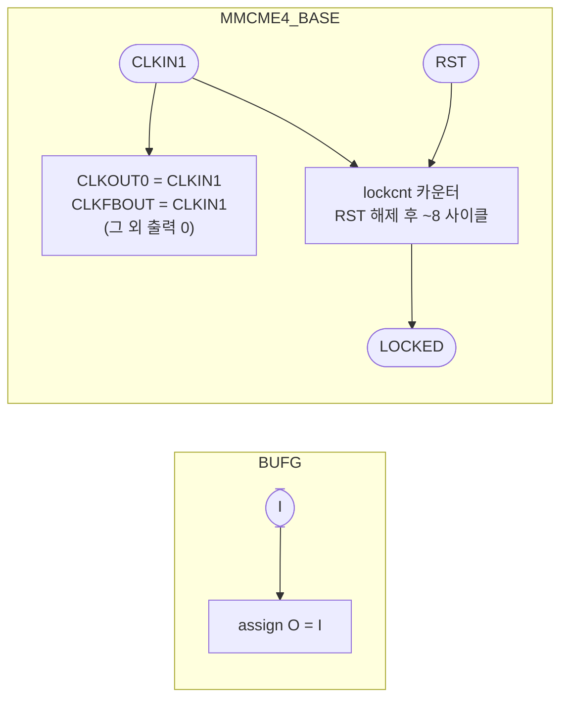

# `xilinx_stubs.sv` 분석

## 개요

`xilinx_stubs.sv`는 `xupv5_microgpt_top`이 사용하는 Xilinx **UltraScale+** 클럭 프리미티브
(`BUFG`, `MMCME4_BASE`)의 **동작 모델(behavioral stub)**입니다. Verilator/iverilog에는 Xilinx
UNISIM 라이브러리가 없으므로, 이 파일로 보드 최상위를 UNISIM 없이 시뮬레이션할 수 있습니다.

> **시뮬레이션 전용** — Vivado 프로젝트에는 포함하지 마세요. 합성에서는 실제 UNISIM 프리미티브를 사용합니다.

모델은 TOP의 필요에 맞춰 사이클 정확합니다: `BUFG`는 입력을 통과시키고, `MMCME4_BASE`는 `CLKIN1`을
`CLKOUT0`/`CLKFBOUT`으로 그대로 전달(사이클 기반 시뮬레이션에서는 x12/15 주파수 비가 무의미 — 전
설계가 단일 테스트벤치 클럭으로 동작)하며, `RST` 해제 몇 사이클 뒤 `LOCKED`를 어서트합니다.

> 원래 설계는 Virtex-5 `DCM_BASE`(CLKFX ×4/5)를 썼으나, Vivado가 Virtex-5를 지원하지 않아
> UltraScale+ `MMCME4_BASE`(100→80 MHz)로 리타깃되었습니다.

## 블록 다이어그램

## 모듈별 설명

### `BUFG` (글로벌 클럭 버퍼)
`assign O = I;` — 글로벌 클럭 버퍼를 통과로 모델링. (MMCM 피드백 경로와 코어 클럭 출력에 각각 사용됨)

### `MMCME4_BASE` (혼합 모드 클럭 매니저)

| 포트/파라미터 | 시뮬레이션 동작 |
|---|---|
| 파라미터 `CLKIN1_PERIOD`/`DIVCLK_DIVIDE`/`CLKFBOUT_MULT_F`/`CLKOUT0_DIVIDE_F` | 선언만(사이클 기반 sim에서 무시) |
| `CLKOUT0`, `CLKFBOUT` | `= CLKIN1` (통과) |
| `CLKFBOUTB`/`CLKOUT0B`/`CLKOUT1..6` 등 | `0` 결선 |
| `LOCKED` | `RST` 해제 후 `lockcnt`가 8에 도달하면 어서트, `RST`에서 리셋(비동기) |

- **`LOCKED` 로직**: `always @(posedge CLKIN1 or posedge RST)`에서 `RST`면 `LOCKED=0`,
  아니면 `lockcnt`를 증가시켜 8 도달 시 `LOCKED=1` → 실제 MMCM의 lock 지연을 모사.

## 핵심 설계 포인트

- **주파수 비 무시**: 실제 MMCM은 CLKOUT0 = CLKIN1 × 12/15(80 MHz)이지만, 사이클 기반 시뮬레이션에서는
  모든 동기 요소가 단일 클럭으로 동작하므로 통과가 정확함.
- **비동기 리셋 lock**: `RST` 상승에서 즉시 unlock, 해제 후 카운터로 재lock.

## RTL과의 관계
`tb_top.sv`가 `xupv5_microgpt_top`과 함께 컴파일하여 TOP의 `MMCME4_BASE`/`BUFG` 인스턴스를 해석.
TOP의 클럭 트리(100 MHz → MMCME4 → 코어 클럭)와 `mmcm_locked` 게이트가 시뮬레이션에서 동작하도록 함.
Vivado 합성에서는 이 stub 대신 실제 UNISIM 프리미티브가 사용됨. `make -C sim tb_top`에서 사용.
