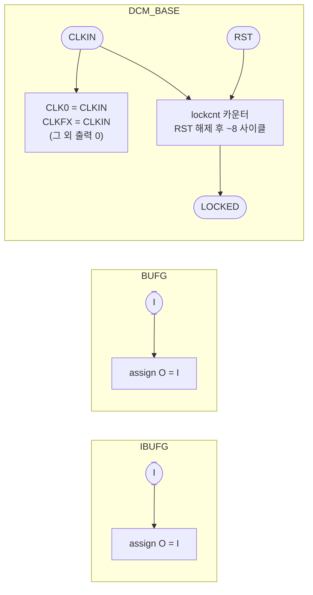

# `xilinx_stubs.v` 분석

## 개요

`xilinx_stubs.v`는 `xupv5_microgpt_top`이 사용하는 Virtex-5 클럭 프리미티브(`IBUFG`, `BUFG`,
`DCM_BASE`)의 **동작 모델(behavioral stub)**입니다. Verilator/iverilog에는 Xilinx UniSim 라이브러리가
없으므로, 이 파일로 보드 최상위를 UniSim 없이 시뮬레이션할 수 있습니다.

> **시뮬레이션 전용** — ISE 합성 프로젝트에는 포함하지 마세요. 합성에서는 실제 UniSim 프리미티브를 사용합니다.

모델은 TOP의 필요에 맞춰 사이클 정확합니다: 클럭 버퍼는 입력을 통과시키고, DCM은 `CLKIN`을
`CLK0`/`CLKFX`로 그대로 전달(사이클 기반 시뮬레이션에서는 4/5 주파수 비가 무의미 — 전 설계가 단일
테스트벤치 클럭으로 동작)하며, `RST` 해제 몇 사이클 뒤 `LOCKED`를 어서트합니다.

## 블록 다이어그램

## 모듈별 설명

### `IBUFG` (입력 클럭 버퍼)
`assign O = I;` — 입력 클럭을 그대로 통과.

### `BUFG` (글로벌 클럭 버퍼)
`assign O = I;` — 글로벌 클럭 버퍼를 통과로 모델링.

### `DCM_BASE` (Digital Clock Manager)

| 포트/파라미터 | 시뮬레이션 동작 |
|---|---|
| 파라미터 `CLKIN_PERIOD`/`CLKFX_MULTIPLY`/`CLKFX_DIVIDE` | 선언만(사이클 기반 sim에서 무시) |
| `CLK0`, `CLKFX` | `= CLKIN` (통과) |
| `CLK90`/`CLK180`/`CLK270`/`CLK2X`/`CLK2X180`/`CLKDV`/`CLKFX180` | `0` 결선 |
| `LOCKED` | `RST` 해제 후 `lockcnt`가 8에 도달하면 어서트, `RST`에서 리셋(비동기) |

- **`LOCKED` 로직**: `always @(posedge CLKIN or posedge RST)`에서 `RST`면 `LOCKED=0`,
  아니면 `lockcnt`를 증가시켜 8 도달 시 `LOCKED=1` → 실제 DCM의 lock 지연을 모사.

## 핵심 설계 포인트

- **주파수 비 무시**: 실제 DCM은 CLKFX = CLKIN × 4/5(80 MHz)이지만, 사이클 기반 시뮬레이션에서는
  모든 동기 요소가 단일 클럭으로 동작하므로 통과가 정확함.
- **비동기 리셋 lock**: `RST` 상승에서 즉시 unlock, 해제 후 카운터로 재lock.

## RTL과의 관계
`tb_top.v`가 `xupv5_microgpt_top`과 함께 컴파일하여 TOP의 `IBUFG`/`BUFG`/`DCM_BASE` 인스턴스를
해석. TOP의 클럭 트리(100 MHz → DCM → 코어 클럭)와 `dcm_locked` 게이트가 시뮬레이션에서 동작하도록 함.
`make -C sim tb_top`에서 사용.
