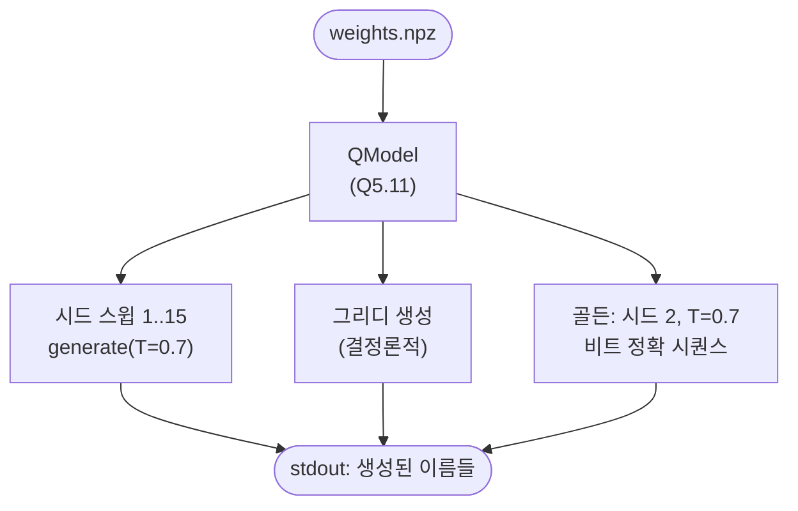

# `check_quant.py` 분석

## 개요

`check_quant.py`는 고정소수점 모델의 **정상 동작 확인(sanity-check)** 스크립트입니다 —
이름들을 생성하고 결정론적 골든을 출력합니다.

## 블록 다이어그램

## 동작

`main()`:
1. `weights.npz` 로드 → `QModel`.
2. `inv_temp = q(1/0.7)` — 온도 0.7의 역수를 Q11로.
3. **샘플 스윕**: 시드 1..15에 대해 `generate()`로 이름을 생성해 출력.
4. **그리디**: 시드 0, 결정론적 argmax 생성.
5. **골든**: 시드 2·T=0.7의 비트 정확 시퀀스(RTL이 반드시 일치해야 하는 것)를 토큰과 함께 출력.

## RTL과의 관계
여기서 출력하는 **GOLDEN**은 `export.py`가 `core_params.vh`에 기록하고 iSim 테스트벤치가
검증하는 것과 동일한 기준입니다. 양자화 후에도 이름 품질과 결정론이 유지되는지 빠르게 확인하는 용도입니다.
