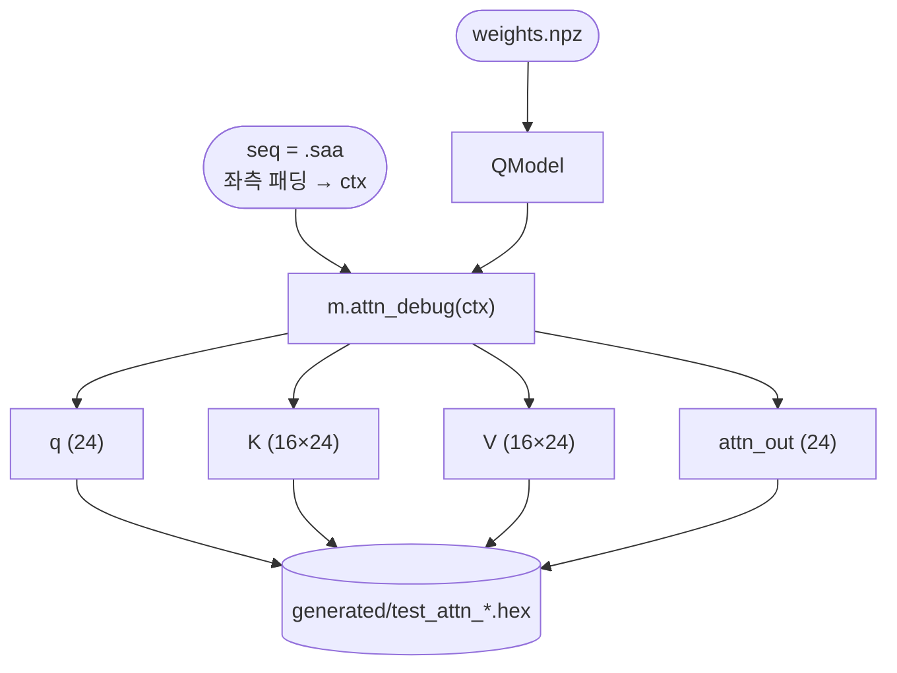

# `dump_attn.py` 분석

## 개요

`dump_attn.py`는 **어텐션 유닛 테스트**를 덤프합니다 — q, K 캐시, V 캐시, 기대 `attn_out`을
16진수 파일로 내보내 RTL 어텐션 유닛 검증에 사용합니다.

## 블록 다이어그램

## 동작

`main()`:
1. `weights.npz` 로드 → `QModel`.
2. 현실적인 컨텍스트 구성: `.saa`(토큰 `[0, 19, 1, 1]`)를 `block_size` 길이로 좌측 패딩.
3. `m.attn_debug(ctx)`로 `(q, k, v, out)`을 얻음.
4. `wr()` 헬퍼로 각각을 16진수 파일로 저장:
   - `test_attn_q.hex` — q (24)
   - `test_attn_k.hex` — K (16×24, 행 우선 `s*24+e`)
   - `test_attn_v.hex` — V (16×24)
   - `test_attn_out.hex` — 기대 출력 (24)
5. `attn_scale`과 기대 `attn_out`을 출력.

## RTL과의 관계
생성된 `.hex` 벡터는 iSim의 어텐션 액추에이터(`attn`) 테스트벤치가 입력/기대값으로 사용하여,
헤드별 softmax + 가중 합이 고정소수점 레퍼런스와 비트 단위로 일치하는지 검증합니다.
