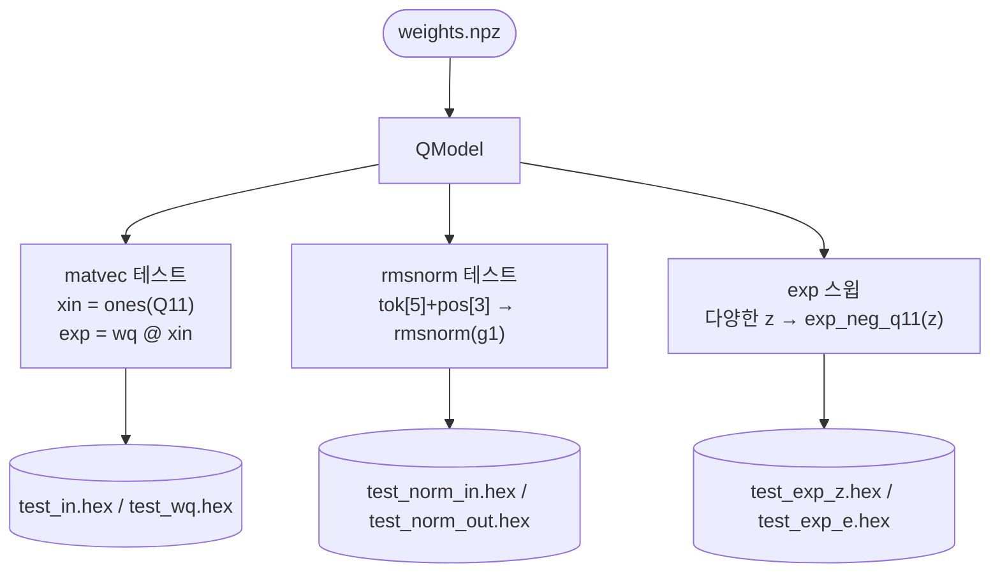

# `dump_test.py` 분석

## 개요

`dump_test.py`는 여러 액추에이터의 **유닛 테스트 벡터**를 덤프합니다 — matvec, RMSNorm, exp에 대해
입력과 기대 출력을 16진수 파일로 내보내 RTL 검증에 사용합니다.

## 블록 다이어그램

## 동작

`main()`:
1. **matvec 테스트**: 입력을 전부 1(Q11의 2048)로 채우고 `wq @ input`을 계산 →
   `test_in.hex`, `test_wq.hex`.
2. **RMSNorm 테스트**: 현실적인 벡터(`tok_embed[5] + pos_embed[3]`, sat16 클램프)를
   `rmsnorm(g1)`에 통과 → `test_norm_in.hex`, `test_norm_out.hex`.
3. **exp 스윕**: 다양한 z 값(0에서 -33000까지 -337 간격 + 경계 케이스 -1, -2047, -2048,
   -2049, -32768)에 대해 `exp_neg_q11(z)`를 계산 → `test_exp_z.hex`, `test_exp_e.hex`.
4. 각 테스트의 요약을 출력.

## RTL과의 관계
이 벡터들은 Verilator의 개별 액추에이터 테스트벤치(matvec, norm, exp_unit)가 사용하는 입력/기대값으로,
각 프리미티브가 `fixedpoint.py`의 정수 레퍼런스와 비트 단위로 일치함을 확인합니다.
`dump_attn.py`가 어텐션 유닛을 다루는 것과 짝을 이루는 저수준 프리미티브 테스트 덤퍼입니다.
