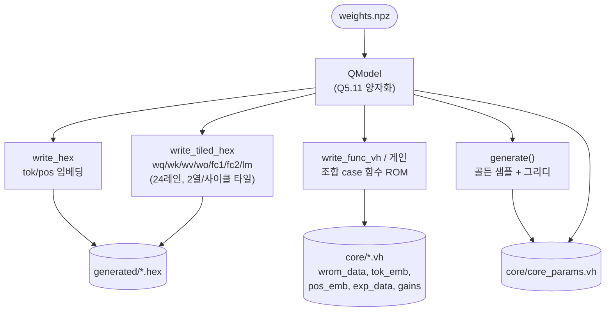

# `export.py` 분석

## 개요

`export.py`는 양자화된 모델을 RTL 아티팩트로 익스포트합니다:
- `generated/*.hex` — 텐서당 하나의 행 우선(row-major) Q5.11 ROM(16비트 2의 보수)
- `core/core_params.vh` — 차원, FRAC, 어텐션 스케일, exp 테이블, 골든

모든 경로는 프로젝트 내부이며 외부 의존성이 없습니다.

## 블록 다이어그램

## 핵심: 왜 두 가지 형식으로 내보내는가

XST 14.7이 작은 `$readmemh` 분산 ROM 배열을 조용히 **0으로 묶는** 버그가 있어서,
코어가 **읽는** 모든 ROM(마이크로코드, 가중치, exp 테이블, 임베딩)은 `.hex`가 아니라
**조합 `case` 함수**(`write_func_vh`)로도 내보냅니다. `.hex` 파일은 시뮬레이션/레퍼런스용으로 남습니다.

## 함수

### `write_hex(name, arr2d)`
행 우선 배열을 4자리(16비트 2의 보수) 16진수 워드/줄로 저장.

### `write_tiled_hex(name, W, lanes=24)`
LANES 병렬, 2열/사이클 matvec 타일을 위한 **와이드 가중치 ROM**:
- 출력 행을 `lanes`행 단위 타일로 분할.
- 각 ROM 워드는 연속된 **두 입력 열**(2j, 2j+1)에 대한 타일 내 LANES개 가중치를 담음.
- 열 2j는 하위 `LANES*16`비트, 열 2j+1은 상위 비트(레인 0 = LSB).
- `in_dim`은 짝수여야 하고, 초과 타일은 0으로 패딩.

### `_tiled_words(W, lanes=24)`
같은 패킹 규칙으로 타일 가중치 ROM을 정수 워드(각 `2*lanes*16`비트) 리스트로 반환 —
`write_func_vh`가 `wrom_data.vh`를 만들 때 사용.

### `write_func_vh(path, func_name, ret_w, idx_w, values, idx2, signed)`
조합 ROM을 **명시적 상수의 Verilog 함수**로 방출. 단일 레벨(`case (idx)`) 또는
2레벨(`sel` → `idx`, wrom_data용) 모두 지원.

### `main()`
1. `weights.npz` 로드 → `QModel`.
2. 임베딩은 `write_hex`, 가중치는 `write_tiled_hex`로 내보냄. exp 테이블은 `exp_tab.hex`.
3. RMSNorm 게인을 `core/gains.vh`에 조합 case 함수(`gain_lut`, gsel 0=g1/1=g2/2=gf)로 내보냄.
4. 코어가 읽는 ROM들을 `wrom_data.vh`, `tok_emb.vh`, `pos_emb.vh`, `exp_data.vh`로 내보냄.
5. `generate()`로 골든(시드 2·T=0.7 샘플, 그리디)을 만들어 `core_params.vh`에 차원/FRAC/
   어텐션 스케일과 함께 주석으로 기록.

## 생성 아티팩트 요약

| 대상 | 형식 | 용도 |
|---|---|---|
| `generated/*.hex` | 16진수 ROM | 시뮬레이션 / 레퍼런스 |
| `core/wrom_data.vh` | 조합 case 함수 | RTL 가중치(합성 신뢰성) |
| `core/gains.vh` | 조합 case 함수 | RMSNorm 게인 |
| `core/{tok_emb,pos_emb,exp_data}.vh` | 조합 case 함수 | 임베딩/exp 테이블 |
| `core/core_params.vh` | localparam + 골든 주석 | 모델 파라미터 |
