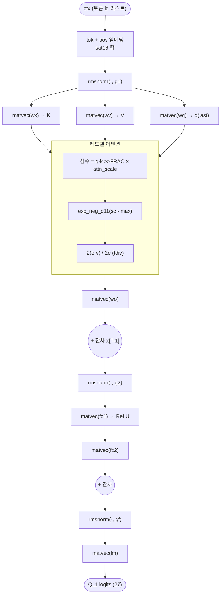

# `fixedpoint.py` 분석

## 개요

`fixedpoint.py`는 NamesGPT의 **고정소수점 정수 레퍼런스**로, RTL 코어가 **비트 단위로 정확히**
재현해야 하는 권위 있는 사양(authoritative spec)입니다. 모든 값은 **Q5.11 부호 있는 16비트**(FRAC=11)이며,
모든 연산은 하드웨어에 직접 매핑되는 정수 연산만 사용합니다:
- 와이드 MAC + 산술 우측 시프트
- RMSNorm을 위한 정수 `isqrt` + 역수
- 테이블 + 보간 방식의 `exp`
- 샘플링을 위한 32비트 LCG

## 블록 다이어그램

`logits_last(ctx)`의 데이터 흐름 (증분 KV 캐시 디코드와 일치):

## 상수와 유틸리티

| 항목 | 값 / 역할 |
|---|---|
| `FRAC` | 11 (소수 비트) |
| `SCALE` | `1 << 11` = 2048 |
| `QMAX`, `QMIN` | 32767, -32768 |
| `sat16(v)` | 16비트 부호 있는 범위로 포화(saturate) |
| `tdiv(a, b)` | 0 방향 절삭 나눗셈(부호-크기 하드웨어 나눗셈기와 일치) |
| `q(x)` | float → Q5.11 포화 int16(반올림) |

### exp 테이블
`EXP_TAB[k] = round(exp(-k) * 2048)`, k = 0..16.
`exp_neg_q11(z)`는 z ≤ 0(Q11)에 대해 정수부로 테이블을 조회하고 소수부로 선형 보간합니다.
z ≥ 0이면 `SCALE`, 정수부가 `EXP_K` 이상이면 0을 반환합니다.

## 핵심 연산 함수

### `matvec(W_q, x_q)`
`y[o] = sat16((Σᵢ W[o,i]·x[i]) >> FRAC)`. int64 누산 후 산술 우측 시프트 + 포화.

### `rmsnorm(x_q, gain_q)`
정수 `isqrt`와 역수로 RMSNorm을 구현:
1. 제곱 합 `ss` (Q22) → 평균 제곱 `mean_sq`
2. `r = isqrt(mean_sq)` (Q11)
3. `scale = 2²² / r` (Q11 역제곱근), `QMAX`로 클램프
4. 각 원소에 `scale` 곱하고 시프트, 다시 `gain` 곱하고 시프트

## `QModel` 클래스

양자화된 NamesGPT — 정수 forward가 계획된 RTL과 동일합니다.

- **`__init__`**: `state_dict`의 모든 텐서를 `q()`로 Q5.11 양자화(임베딩, 게인 g1/g2/gf,
  wq/wk/wv/wo, fc1/fc2, lm). `attn_scale = q(1/√head_dim)`.
- **`attn_debug(ctx)`**: `(qlast, k, v, attn_out)`를 반환 — RTL 어텐션 유닛 테스트용.
- **`logits_last(ctx)`**: 마지막 위치의 Q11 logits를 반환. 임베딩 → 어텐션 서브레이어 →
  MLP 서브레이어 → 최종 norm + LM 헤드 전체 경로를 정수 연산으로 실행. 증분 KV 캐시 디코드와 일치.

## 결정론적 샘플러

- **`lcg_next(state)`**: 32비트 LCG(Numerical Recipes 상수 1664525, 1013904223).
- **`generate(model, seed, inv_temp_q11, max_len, greedy)`**:
  - 시작 토큰 `.`(0)에서 시작해 증분적으로 한 이름을 생성(절대 위치).
  - `greedy`면 argmax, 아니면 온도 스케일링 후 exp → LCG로 범주형 샘플링.
  - 토큰 0(`.`)이 나오면 종료. `(token_ids, string)` 반환.

## RTL과의 관계
이 파일이 **골든(golden)의 원천**입니다. `export.py`와 `check_quant.py`가 `generate()`를 호출해
시드 2·T=0.7의 비트 정확 시퀀스를 만들며, RTL 코어와 Verilator 테스트벤치가 이를 정확히 재현해야 합니다.
