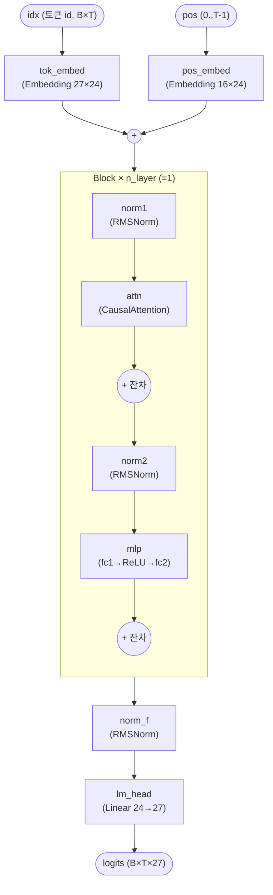
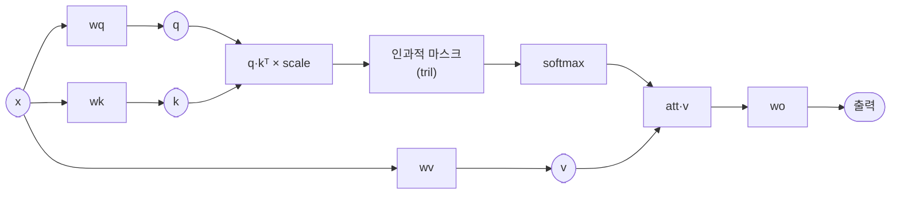

# `model.py` 분석

## 개요

`model.py`는 하드웨어 이름 생성기를 위한 **부동소수점 레퍼런스 문자 단위 언어 모델**을 정의합니다.
이 프로젝트를 위해 처음부터 작성된 작은 디코더 전용 트랜스포머(블록 1개)이며, 여기서 학습한 다음
RTL 코어를 위해 고정소수점으로 양자화하는 **부동소수점 레퍼런스**입니다.

주요 설계 선택:
- **어휘**: 구분자 `.`(id 0) + `a`–`z`(1–26), 총 27개
- **RMSNorm** 사전 정규화(pre-normalization)
- **ReLU** MLP
- 스케일드 닷-프로덕트 **인과적(causal) 어텐션**

## 블록 다이어그램

`CausalAttention` 내부:

## 구성 요소

### `ModelConfig` (dataclass)
모델 하이퍼파라미터를 담습니다.

| 필드 | 값 | 의미 |
|---|---|---|
| `vocab_size` | 27 | `.` + a..z |
| `block_size` | 16 | 최대 컨텍스트(= 최대 생성 길이) |
| `n_embed` | 24 | 모델 폭 |
| `n_head` | 4 | 어텐션 헤드 수 |
| `head_dim` | 6 | `n_head * head_dim == n_embed` |
| `mlp_hidden` | 96 | MLP 내부 폭 |
| `n_layer` | 1 | 트랜스포머 블록 수 |

### `RMSNorm`
평균 제곱근 레이어 정규화 — 평균 차감이나 바이어스 없이, 제곱 평균(`ms`)의 역제곱근(`rsqrt`)을 곱한 뒤
학습 가능한 `gain`을 곱합니다. `eps=1e-5`로 0 나눗셈을 방지합니다.

### `CausalAttention`
- `wq`, `wk`, `wv`, `wo` 4개의 바이어스 없는 선형 projection.
- q·kᵀ에 `scale = head_dim ** -0.5`를 곱한 뒤 하삼각(`tril`) 마스크로 미래 위치를 `-inf`로 채우고
  softmax → v와 곱합니다.
- 멀티헤드는 `view` + `transpose`로 `(B, n_head, T, head_dim)` 형태로 재배치하여 처리합니다.

### `MLP`
`fc2(ReLU(fc1(x)))` — 24 → 96 → 24, 바이어스 없음.

### `Block`
사전 정규화 잔차 구조: `x = x + attn(norm1(x))` → `x = x + mlp(norm2(x))`.

### `NamesGPT`
전체 모델: 토큰 임베딩 + 위치 임베딩 → 블록들 → 최종 RMSNorm(`norm_f`) → LM 헤드.
`forward`는 **절대 위치**(`torch.arange(T)`)를 사용하므로 추론 시 증분 KV 캐시가 가능합니다.

## RTL과의 관계
이 부동소수점 모델은 `fixedpoint.py`가 Q5.11로 양자화하는 대상이며, 학습된 가중치는
`train.py`에서 `weights.npz`로 저장되고 `export.py`가 RTL ROM으로 익스포트합니다.
