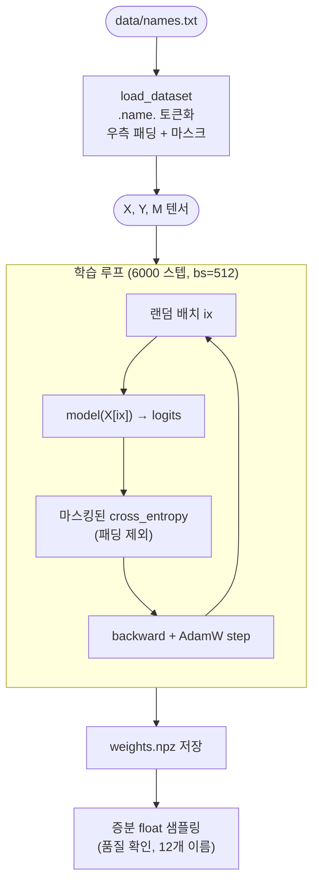

# `train.py` 분석

## 개요

`train.py`는 공개 makemore 이름 코퍼스(`data/names.txt`)로 레퍼런스 NamesGPT를 학습하고,
부동소수점 가중치를 `tools/weights.npz`로 저장합니다.

**절대 위치**(토큰 i는 항상 위치 i)를 사용하는 표준 인과적 학습이므로, 추론 시 증분 KV 캐시가
가능합니다(시퀀스가 길어져도 어떤 토큰의 K/V도 바뀌지 않음). 이름은 시퀀스 `. n a m e .`로
모델링되며, 모든 위치에서 다음 토큰을 예측합니다. 어휘: 0=`.`, 1..26=`a`..`z`.

## 블록 다이어그램

## 상수

| 항목 | 값 |
|---|---|
| `SEED` | 1337 |
| 학습률 | 3e-3 (AdamW, weight_decay=1e-4) |
| 배치 크기 | 512 |
| 스텝 수 | 6000 |

## 함수

### `build_vocab()`
문자 리스트 `["."] + a..z`에서 `stoi`(문자→id), `itos`(id→문자) 딕셔너리를 만듭니다.

### `load_dataset(cfg, stoi)`
전체 시퀀스 예제(절대 위치)를 생성:
- 각 이름을 `[0] + [문자 id들] + [0]`로 토큰화하여 `block_size + 1`로 자름.
- `x = toks[:-1]`, `y = toks[1:]` (다음 토큰 예측).
- `block_size`까지 0으로 우측 패딩하고, 마스크 `M`(유효 위치 1.0, 패딩 0.0)을 만듦.
- `(X, Y, M)` 텐서 반환.

### `main()`
1. 시드 고정, 설정/어휘/데이터셋 로드, 파라미터 수 출력.
2. AdamW로 6000 스텝 학습 — 마스크로 패딩 위치의 손실을 제외.
3. 500 스텝마다 손실 출력.
4. `state_dict`를 numpy로 변환하여 `weights.npz` 저장.
5. `eval` 모드에서 증분 float 샘플링(온도 0.7)으로 12개 이름을 생성해 품질을 확인.

## RTL과의 관계
`train.py` → `weights.npz` → (`export.py`가 양자화·익스포트) → RTL ROM.
학습 단계에서 **절대 위치**를 쓴 것이 하드웨어의 영속적 KV 캐시를 가능하게 한 핵심 결정입니다.
