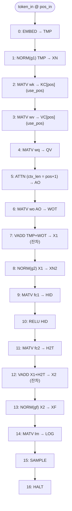

# `ucode_asm.py` 분석

## 개요

`ucode_asm.py`는 **마이크로어셈블러**입니다 — 영속적 KV 캐시를 사용하는 **증분 디코딩**을 위한
코어의 제어 프로그램(마이크로코드)을 방출합니다. 토큰당 코어는 **하나의 위치**만 처리합니다:
새 토큰을 임베딩하고, 그 K/V를 캐시 슬롯 `KC[pos]`/`VC[pos]`에 계산한 뒤, 유효 위치 0..pos에
어텐션을 수행하고, MLP → LM 헤드 → 샘플링합니다.

KC/VC 캐시는 `vmem`에 있고 토큰들에 걸쳐 유지됩니다(작업 벡터는 라이브 레인지 기준으로 0..255에
패킹되어 캐시 영역 256..1023을 절대 건드리지 않습니다).

## 블록 다이어그램

한 토큰의 마이크로코드 프로그램 실행 순서:

## vmem 메모리 맵 (AW=10)

작업 벡터는 0..255에 패킹(라이브 레인지로 재사용), KV 캐시는 256..1023에 영속.

| 심볼 | 주소 | 페이즈 |
|---|---|---|
| `TMP`/`XN`/`QV`/`AO`/`WOT`/`X1`/`XN2` | 0/24/48/72/96/120/144 | A 작업 세트 |
| `HID`/`H2T`/`X2`/`XF`/`LOG` | 0/96/144/0/24 | B (죽은 A 슬롯 재사용) |
| `KC`/`VC` | 256/640 | 영속 KV 캐시(각 16×24) |

## 인코딩

### `enc(op, wsel, in_dim, out_dim, descale, gsel, a, b, d, use_pos)`
하나의 마이크로 명령을 72비트 워드로 비트 패킹:

| 비트 | 필드 |
|---|---|
| 0–3 | op |
| 4–7 | wsel (가중치 선택) |
| 8–14 | in_dim |
| 15–21 | out_dim |
| 22–26 | descale (시프트량) |
| 27–28 | gsel (게인 선택) |
| 33–43 | a (소스 A 주소) |
| 44–54 | b (소스 B 주소) |
| 55–65 | d (목적지 주소) |
| 66 | use_pos (`d += pos_in*N_EMBED`, KV 캐시 쓰기 슬롯) |

### 오피코드 / 선택자
- `OP`: NOP, EMBED, NORM, MATV, ATTN, VADD, RELU, SAMPLE, HALT (0..8)
- `WS`: WQ, WK, WV, WO, FC1, FC2, LM (0..6)
- `GS`: G1, G2, GF (0..2)

## 함수

### `build()`
위 블록 다이어그램의 17개 명령 리스트를 반환합니다.

### `main()`
1. `generated/ucode.hex`에 18자리 16진수(72비트) 워드/줄로 프로그램 저장.
2. `core/ucode_rom.vh`에 **조합 case 함수**로 마이크로코드 ROM을 방출 — `$readmemh`가 아님.
   XST 14.7이 작은 `$readmemh` 분산 ROM을 0으로 묶어 프로그램이 전부 NOP가 되면 시퀀서가
   `HALT`에 도달하지 못하고 코어가 멈추기 때문. `default`는 안전을 위해 `OP_HALT`.
3. `core/coremap.vh`에 메모리 맵 주소(`A_*`)와 오피코드(`OP_*`), 명령 수(`NINSTR`)를 localparam으로 방출.

## RTL과의 관계
이 프로그램이 하드웨어 시퀀서를 구동합니다. `ucode.hex`(시뮬레이션)와 `ucode_rom.vh`(합성)가
같은 프로그램의 두 표현이며, `coremap.vh`가 RTL과 어셈블러 간의 심볼 정의를 공유합니다.
